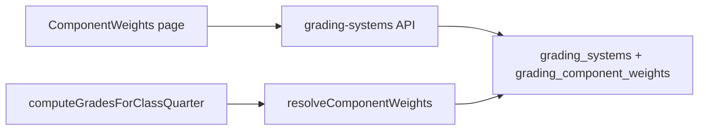

# Component weights — function documentation

Configurable **WW / PT / QA** component weights per grade band, managed through **grading system profiles**. Powers the weighted initial grade step in the DepEd grading pipeline (GAP-103).

**Canonical schema:** [deped-grading.md](../schemas/deped-grading.md) · **Grading pipeline:** [DepEd-Grading-Engine-Function-Doc.md](./DepEd-Grading-Engine-Function-Doc.md)

---

## Overview

| Grade band | WW | PT | QA |
|------------|----|----|-----|
| Grades 1–6 | 30% | 50% | 20% |
| Grades 7–10 | 40% | 40% | 20% |
| Grades 11–12 | 25% | 50% | 25% |

The table above is the **seed default** for the active profile `"DepEd K–12 (Default)"`. Schools may create additional profiles, edit percentages on `/deped/component-weights`, and activate exactly one system for computation.

---

## Data model

### `grading_systems`

| Column | Type | Notes |
|--------|------|-------|
| `id` | TEXT PK | UUID |
| `name` | TEXT | Display name, max 120 chars |
| `is_active` | INTEGER | 0/1 — at most one active per deployment |
| `created_at`, `updated_at` | INTEGER | Timestamps |

### `grading_component_weights`

| Column | Type | Notes |
|--------|------|-------|
| `id` | TEXT PK | UUID |
| `grading_system_id` | TEXT FK | CASCADE delete |
| `grade_band_min`, `grade_band_max` | INTEGER | Fixed v1 bands: 1–6, 7–10, 11–12 |
| `ww_weight`, `pt_weight`, `qa_weight` | REAL | Stored as fractions 0–1 |

**Unique:** `(grading_system_id, grade_band_min, grade_band_max)`

---

## API reference

| Method | Path | Purpose |
|--------|------|---------|
| GET | `/api/deped/grading-systems` | List all profiles (`id`, `name`, `isActive`, `updatedAt`) |
| POST | `/api/deped/grading-systems` | Create profile — body `{ name }`; clones default weights; inactive |
| PATCH | `/api/deped/grading-systems/:id/activate` | Activate one profile; deactivate all others |
| GET | `/api/deped/grading-systems/:id/weights` | List 3 bands with display percents + labels |
| PUT | `/api/deped/grading-systems/:id/weights` | Replace weights — body `{ bands: [...] }` |

---

## Validation rules

Applied on **PUT weights** (server) and mirrored on the **Component Weights** page (client):

1. Exactly **3 bands** with fixed ranges: `(1,6)`, `(7,10)`, `(11,12)`.
2. Each of **WW, PT, QA**: required number, `>= 0`, `<= 100` (display percents).
3. **Row sum:** `WW + PT + QA === 100` (rounded to 2 decimal places).
4. **Create name:** non-empty trimmed string, max 120 characters; unique case-insensitive.
5. **Activate:** target profile must have a complete valid weight set.

Invalid requests return **400** with an error message.

---

## UI (`/deped/component-weights`)

1. **Grading systems list** — name, Active badge, Edit weights, Activate (disabled when already active).
2. **Create from defaults** — name field + button; clones DepEd default table.
3. **Weight editor** — editable table: Grade band | WW (%) | PT (%) | QA (%) | Total.
   - Row total turns red when not 100.
   - Save disabled until all validations pass.
   - **Reset to DepEd defaults** fills the form (does not persist until Save).
4. After save: link to **DepEd Reports** to recompute grades (auto-recompute deferred — GAP-105).

Nav: **Component Weights** in app shell (near DepEd Reports).

---

## Grade computation

`computeGradesForClassQuarter` in `deped.service.ts` calls `resolveComponentWeights(db, class.gradeLevel)`:

1. Load weights for the **active** grading system.
2. Parse numeric grade from `grade_level` string (same rules as legacy `defaultWeights`).
3. Match band row (1–6, 7–10, 11–12).
4. Return `{ ww, pt, qa }` fractions for weighted initial grade.
5. **Fallback:** `defaultWeights()` if no active system or missing band row.

---

## Entry CW-001 — Component weights customization (GAP-103)

**Date:** 2026-07-06

**Summary:** Grading system profiles with editable WW/PT/QA weight table per grade band; API + `/deped/component-weights` page; compute pipeline reads active system.

**Reason:** DepEd component weights can change by memo or grade band; hardcoded `defaultWeights()` could not be updated without a code deploy.

**What changed:**
- **DDL:** `grading_systems`, `grading_component_weights`; seed `"DepEd K–12 (Default)"` active with official weights.
- **Backend:** `gradingSystem` DAO/queries/service; `resolveComponentWeights` + `validateWeightBands` in `gradingWeights.ts`.
- **API:** CRUD-style routes under `/api/deped/grading-systems`.
- **Compute:** `deped.service.ts` uses active system weights.
- **Frontend:** `ComponentWeights` page — list, create, activate, editable table with validation.
- **Tests:** `gradingWeights.test.ts` — validation, resolution, service integration.

**Files involved:**
- `tdtd-node/src/db/migrate.ts`
- `tdtd-node/src/schema/types.ts`
- `tdtd-node/src/queries/gradingSystem.queries.ts`
- `tdtd-node/src/dao/gradingSystem.dao.ts`
- `tdtd-node/src/services/gradingSystem.service.ts`
- `tdtd-node/src/lib/gradingWeights.ts`, `gradingWeights.test.ts`
- `tdtd-node/src/services/deped.service.ts`
- `tdtd-node/src/routes/deped.routes.ts`
- `tdtd-frontend/src/api/gradingSystemApi.ts`
- `tdtd-frontend/src/pages/ComponentWeights/ComponentWeights.tsx`
- `tdtd-frontend/src/App.tsx`, `layouts/AppShell.tsx`

**Schemas involved:**
- [deped-grading.md](../schemas/deped-grading.md)

**Verification:**
1. Open `/deped/component-weights` — seeded default system is Active with 30/50/20, 40/40/20, 25/50/25.
2. Edit a row so sum ≠ 100 — Save disabled; error list shown.
3. Fix row to sum 100 — Save succeeds; reload persists values.
4. Create second system, change weights, Activate — `POST .../grades/compute` uses new weights for matching grade band.
5. `npm test` in `tdtd-node` — `gradingWeights.test.ts` passes.

---
