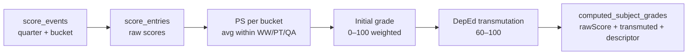

# DepEd grading engine — function documentation

Server-side **DepEd K–12 grading pipeline**: raw scores → WW/PT/QA buckets → weighted initial grade → transmutation → descriptors → quarterly grades in `computed_subject_grades`. Powers SF5, SF9, SF10 report autofill.

**Canonical schema:** [deped-grading.md](../schemas/deped-grading.md) · **Score entry:** [Quiz-Function-Doc.md](./Quiz-Function-Doc.md) · **Forms:** [DepEd-School-Forms-Function-Doc.md](./DepEd-School-Forms-Function-Doc.md)

---

## Pipeline overview

| Step | DepEd requirement | TDTD implementation |
|------|-------------------|---------------------|
| Assessment classification | Map each score to WW, PT, or QA | `score_events.assessment_bucket` derived from kind + subtype; optional override |
| Quarter scoping | Q1–Q4 per school year | `score_events.quarter` (1–4), required on create |
| Component weights | WW/PT/QA % by grade band | Active grading system via `resolveComponentWeights()` — [Components-Weights-Function-Doc.md](./Components-Weights-Function-Doc.md) |
| PS (percentage score) | `(score / max) × 100`, averaged per bucket | `computeGradesForClassQuarter` in `deped.service.ts` |
| Initial grade | Weighted sum of bucket PS | Stored as `computed_subject_grades.raw_score` |
| Transmutation | Official table → 60–100 | `transmuteRawPercent()` in `transmutation.ts` |
| Descriptive rating | O / VS / S / FS / D | `descriptorForGrade()` |
| Quarterly grade API | Per student, subject, quarter | `GET/POST /api/deped/classes/:classId/grades` |
| Final grade / ranking | End-of-year subject grade, class rank | **Deferred** — GAP-101 |

---

## Assessment classification (GAP-081)

| `kind` | `subtype` (UI code) | Default `assessmentBucket` |
|--------|---------------------|----------------------------|
| QUIZ | RZ, WZ, QZ, (none) | WW |
| PARTICIPATION | — | WW |
| EXAM | QE | QA |
| EXAM | (none) | WW — use bucket override for PT |

Logic: [`assessmentBucket.ts`](../../tdtd-node/src/lib/assessmentBucket.ts) · UI override on Scores create form.

Subtype codes are stored on `score_events.subtype` for audit; bucket is persisted separately.

---

## Component weights (default)

| Grade band | WW | PT | QA |
|------------|----|----|-----|
| Grades 1–6 | 30% | 50% | 20% |
| Grades 7–10 | 40% | 40% | 20% |
| Grades 11–12 | 25% | 50% | 25% |

Parsed from `classes.grade_level` string. **Configurable** — GAP-103 shipped; see [Components-Weights-Function-Doc.md](./Components-Weights-Function-Doc.md).

---

## Computation algorithm (GAP-082)

For each `(studentId, subjectId, quarter)` in a class:

1. Load `score_entries` joined to `score_events` where `se.quarter = @quarter` and score is non-null.
2. Convert each entry to percentage: `(score / max_score) × 100` when `max_score > 0`, else treat raw score as percentage.
3. Group by assessment bucket (WW / PT / QA); arithmetic mean within each bucket.
4. Apply grade-band weights → **initial grade** (`rawScore`).
5. **Transmute** via official DepEd table.
6. Assign **descriptor** from transmuted grade.
7. Upsert `computed_subject_grades` (skips rows with `manual_override = 1` on recompute).

---

## API reference

| Method | Path | Purpose |
|--------|------|---------|
| POST | `/api/classes/:classId/score-events` | Create event — requires `quarter` (1–4); optional `subtype`, `assessmentBucket` |
| GET | `/api/deped/classes/:classId/grades?quarter=&subjectId=&schoolYearId=` | List computed grades |
| POST | `/api/deped/classes/:classId/grades/compute` | Recompute quarter grades — body: `{ quarter, schoolYearId? }` |
| POST | `/api/deped/classes/:classId/reports/autofill` | Compute Q1–Q4 + archive enrollment |

Manual override (`PATCH /api/deped/classes/:classId/grades/:gradeId`) — **deferred** (GAP-102).

---

## MVP vs deferred

### Shipped (MVP)

- Quarter + bucket on score event create (backend + Scores UI)
- Official DepEd transmutation table
- `raw_score` persisted on computed grades
- End-to-end quarter compute from score entry
- `subjectId` filter on grades list API

### Deferred

| Feature | Gap ID |
|---------|--------|
| `school_year_quarters` calendar + date→quarter inference | GAP-100 |
| Final grade (`quarter = 0`) + class rank | GAP-101 |
| Manual grade override API + UI | GAP-102 |
| ~~Configurable WW/PT/QA weights~~ | ~~GAP-103~~ — shipped ([Components-Weights-Function-Doc.md](./Components-Weights-Function-Doc.md)) |
| Performance exam subtype (PT default) | GAP-104 |
| Auto recompute on score save | GAP-105 |

---

## Entry GRD-001 — DepEd grading engine MVP (GAP-080–082)

**Date:** 2026-06-18

**Summary:** Wire quarter and WW/PT/QA bucket through score event creation; replace linear transmutation with the official DepEd lookup table; persist initial grade as `rawScore`; fix quarter grade computation path end-to-end.

**Reason:** Grade computation existed at the service layer but score events never received `quarter` or `assessment_bucket`, so `computeGradesForClassQuarter` matched zero rows. Transmutation used a simplified linear formula instead of the official table.

**What changed:**
- **Score events:** `quarter` (required), `subtype`, `assessment_bucket` on create; DAO/queries updated; backfill migration for legacy rows (`quarter=1`, `bucket=WW`).
- **Bucket mapping:** `resolveAssessmentBucket()` — QUIZ/PARTICIPATION → WW; EXAM+QE → QA; optional override for PT.
- **Transmutation:** Full DepEd band table in `transmutation.ts`; unit tests for boundary values.
- **Computed grades:** `raw_score` column; stored on compute.
- **API:** `subjectId` query on grades GET.
- **Frontend:** Quarter picker + bucket override on Scores create; Q/bucket badges on event list.
- **Docs:** This file; schema and backlog updates.

**Files involved:**
- `tdtd-node/src/lib/assessmentBucket.ts`, `transmutation.ts` (+ tests)
- `tdtd-node/src/db/migrate.ts`
- `tdtd-node/src/dao/scoreEvent.dao.ts`, `queries/scoreEvent.queries.ts`
- `tdtd-node/src/services/score.service.ts`, `deped.service.ts`
- `tdtd-node/src/queries/grade.queries.ts`, `routes/deped.routes.ts`
- `tdtd-node/src/schema/types.ts`
- `tdtd-frontend/src/pages/Scores/Scores.tsx`, `api/scoreApi.ts`, `api/depedApi.ts`
- `tdtd-frontend/src/constants/TDTDConstants.ts`, `types/schema.ts`

**Schemas involved:**
- [deped-grading.md](../schemas/deped-grading.md)
- [quiz.md](../schemas/quiz.md)

**Verification:**
1. Create score event with Q1, enter scores with maxScore.
2. `POST /api/deped/classes/:classId/grades/compute` with `{ quarter: 1 }`.
3. Confirm `computed_subject_grades` row has `rawScore`, `transmutedGrade`, `descriptor`.

---
