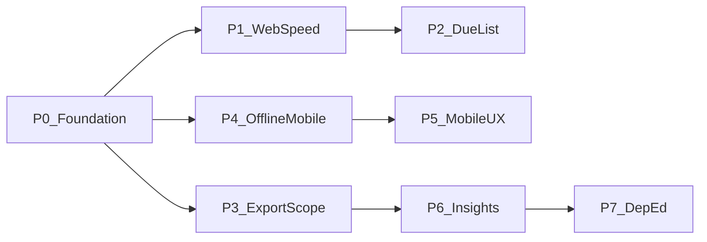

# Prioritized gap backlog

Actionable backlog derived from [Spec-Align-Doc.md](./Spec-Align-Doc.md). Each item maps **1:1** to an existing plan doc, schema note, or function doc section — no orphan work items.

**Related:** [Spec-Align-Doc.md](./Spec-Align-Doc.md) · [Mobile-App-Version-Plan.md](./Mobile-App-Version-Plan.md) · [MH-Mobile-App-Deployment.md](../must-haves/MH-Mobile-App-Deployment.md) · [Due-List-Function-Doc.md](./Due-List-Function-Doc.md) · [Role-Based-Function.md](./Role-Based-Function.md) · [sync.md](../schemas/sync.md) · [core.md](../schemas/core.md) · [quiz.md](../schemas/quiz.md)

**Status:** Living doc · **Last reviewed:** 2026-06-07

---

## How to use this doc

| Column | Meaning |
|--------|---------|
| **ID** | Stable backlog id (`GAP-###`) |
| **Pri** | Execution tier — lower number = do sooner |
| **Spec §** | Checklist section in [Spec-Align-Doc.md](./Spec-Align-Doc.md) |
| **Source doc** | Where requirements already live (section or checklist item) |
| **Depends** | Must ship or decide before starting |
| **Closes** | Spec items this item satisfies when done |

**Priority tiers**

| Tier | Theme | Rationale |
|------|-------|-----------|
| **P0** | Foundation & security | Unblocks hosted/mobile/multi-teacher; prevents wrong data exposure |
| **P1** | Speed (web) | Highest teacher ROI on current web stack; no new infra |
| **P2** | Workflow & reminders | Extends shipped DueList/batch pattern |
| **P3** | Data ownership & export | Interoperability + transfer-school story |
| **P4** | Offline mobile | PH differentiator; follows Mobile plan Phases 0–5 |
| **P5** | Mobile UX speed | Swipe/keypad after offline path exists |
| **P6** | Smart insights (rules-first) | Extend Student Lab before AI |
| **P7** | DepEd automation | Large domain epic; needs stable scores + quarters model |
| **P8** | Deferred / low urgency | Modular product, advanced AI, full-day attendance model |

---

## P0 — Foundation and security

Prerequisites for public hosting, per-teacher isolation, and safe mobile sync.

| ID | Title | Spec § | Source doc | Depends | Closes |
|----|-------|--------|------------|---------|--------|
| GAP-001 | Scope domain data to authenticated teacher (`userId` on classes, students, attendance, scores) | §2, §12 | [MH-Mobile-App-Deployment.md](../must-haves/MH-Mobile-App-Deployment.md) §A4 IDOR review; [Role-Based-Function.md](./Role-Based-Function.md) authorization matrix; [core.md](../schemas/core.md) future extensions | AUTH-001 shipped | Personal workspace; teacher owns data |
| GAP-002 | Enforce IDOR on all read/write routes (filter by `req.auth.id`) | §12 | [MH-Mobile-App-Deployment.md](../must-haves/MH-Mobile-App-Deployment.md) §A4; [Role-Based-Function.md](./Role-Based-Function.md) §2 middleware | GAP-001 | Data ownership; safe hosting |
| GAP-003 | Deploy `tdtd-node` to HTTPS with persistent SQLite volume + backups | §3, §12 | [Mobile-App-Version-Plan.md](./Mobile-App-Version-Plan.md) Phase 1; [MH-Mobile-App-Deployment.md](../must-haves/MH-Mobile-App-Deployment.md) §A1 | — | Sync endpoint reachable; production auth |
| GAP-004 | Production CORS allowlist + secrets matrix (`dev` / `staging` / `prod`) | §12 | [Mobile-App-Version-Plan.md](./Mobile-App-Version-Plan.md) Phase 1; [MH-Mobile-App-Deployment.md](../must-haves/MH-Mobile-App-Deployment.md) §A1, §A4 | GAP-003 | Safe public API |
| GAP-005 | Mobile secure token storage (replace `sessionStorage` on Capacitor) | §3, §12 | [MH-Mobile-App-Deployment.md](../must-haves/MH-Mobile-App-Deployment.md) §A3; [Mobile-App-Version-Plan.md](./Mobile-App-Version-Plan.md) Phase 2 | GAP-003 | Play Store online-only v1 |
| GAP-006 | Lock Phase 0 product decisions (offline scope, conflict policy, notification policy) | §3, §10 | [Mobile-App-Version-Plan.md](./Mobile-App-Version-Plan.md) Phase 0; [MH-Mobile-App-Deployment.md](../must-haves/MH-Mobile-App-Deployment.md) §B | — | Unblocks offline implementation |

**GAP-001 implementation sketch (for agents):**

- Migration: add `user_id` FK to `classes` (and cascade scope to students via `classId`, or denormalize for query speed).
- Backfill: assign existing rows to first user or migration script per deployment.
- Update DAOs/services: all list/create/update filtered by authenticated user.
- Document in [core.md](../schemas/core.md) when shipped.

---

## P1 — Speed differentiator (web, no new infra)

Target: **faster than Excel** for daily attendance and score entry on the current web app.

| ID | Title | Spec § | Source doc | Depends | Closes |
|----|-------|--------|------------|---------|--------|
| GAP-010 | Attendance auto-save (debounced save on toggle; remove Save button or keep as fallback) | §1 | **TBD epic** — track here; touches [Attendance-Function-Doc.md](./Attendance-Function-Doc.md), [`AttendanceSession.tsx`](../../tdtd-frontend/src/pages/AttendanceSession/AttendanceSession.tsx) | — | Instant auto-save |
| GAP-011 | Default “all present” on class load (invert to uncheck absentees) | §1 | **TBD epic** — aligns with “mark all present except…” | GAP-010 optional | “Mark all present except…” |
| GAP-012 | Score sheet auto-save in edit mode (debounced `PUT` entries) | §1 | [Quiz-Function-Doc.md](./Quiz-Function-Doc.md); [`ScoreGrading.tsx`](../../tdtd-frontend/src/pages/ScoreGrading/ScoreGrading.tsx) | — | Instant auto-save |
| GAP-013 | Keyboard-first score entry (Enter advances row; optional Tab column) | §1 | **TBD epic** — [`ScoreGrading.tsx`](../../tdtd-frontend/src/pages/ScoreGrading/ScoreGrading.tsx) | GAP-012 optional | Keyboard-first input |
| GAP-014 | Paste column of scores from clipboard (map to roster order) | §1, §7 | **TBD epic** — reuse patterns from [`studentImportParse.ts`](../../tdtd-frontend/src/lib/studentImportParse.ts) | — | Paste-from-Excel for scores |
| GAP-015 | Streamline attendance: skip class picker when only one class for period | §1 | [Attendance-Function-Doc.md](./Attendance-Function-Doc.md); partial auto-pick in [`AttendanceSession.tsx`](../../tdtd-frontend/src/pages/AttendanceSession/AttendanceSession.tsx) | — | One-tap attendance (partial) |
| GAP-016 | Reduce school-year setup friction (sensible defaults on first login wizard) | §2 | [Subject-Function-Doc.md](./Subject-Function-Doc.md); [Mobile-App-Version-Plan.md](./Mobile-App-Version-Plan.md) Phase 0 offline scope (defer SY registration offline) | — | Zero setup |

**Suggested P1 sprint order:** GAP-015 → GAP-011 → GAP-010 → GAP-012 → GAP-013 → GAP-014 → GAP-016

---

## P2 — Workflow and reminders (DueList extensions)

Extends the shipped DueList + batch pattern — mapped to [Due-List-Function-Doc.md](./Due-List-Function-Doc.md) **Out of v1**.

| ID | Title | Spec § | Source doc | Depends | Closes |
|----|-------|--------|------------|---------|--------|
| GAP-020 | DueList kind: **Scores** — event exists, no entries saved | §10 | [Due-List-Function-Doc.md](./Due-List-Function-Doc.md) “Scores” row; extend `DueItem.kind` | — | “Haven’t encoded grades…” |
| GAP-021 | DueList kind: **Setup** — no active school year or empty class roster | §2, §10 | [Due-List-Function-Doc.md](./Due-List-Function-Doc.md) “Setup” row | — | Zero setup nudge |
| GAP-022 | DueList kind: **Past attendance** — missing AM/PM in last N school days | §10 | [Due-List-Function-Doc.md](./Due-List-Function-Doc.md) “Past attendance” row; complements `/due-list/missed` | — | Missed work proactive |
| GAP-023 | Re-surface dismissed attendance due before end of day (optional) | §10 | [Due-List-Function-Doc.md](./Due-List-Function-Doc.md) “Dismiss vs done” v1 note | — | Smarter reminders |
| GAP-024 | Deploy `tdtd-batch` in production for AM/PM reminder jobs | §10 | [TDTD-Batch-Function.md](./TDTD-Batch-Function.md); [MH-Mobile-App-Deployment.md](../must-haves/MH-Mobile-App-Deployment.md) §A1 | GAP-003 | Reliable attendance nudges |

**Suggested P2 order:** GAP-024 → GAP-020 → GAP-021 → GAP-022 → GAP-023

---

## P3 — Data ownership and interoperability

| ID | Title | Spec § | Source doc | Depends | Closes |
|----|-------|--------|------------|---------|--------|
| GAP-030 | Export roster to `.xlsx` (class or all classes) | §7, §12 | **TBD epic** — mirror [`studentImportSampleXlsx.ts`](../../tdtd-frontend/src/lib/studentImportSampleXlsx.ts) | GAP-001 | Export to Excel |
| GAP-031 | Export score event / class grade sheet to `.xlsx` | §7 | **TBD epic** — [`scoreApi.ts`](../../tdtd-frontend/src/api/scoreApi.ts) | GAP-001 | Export; copy/paste grade tables (partial) |
| GAP-032 | Full teacher data export (JSON or zip: classes, students, attendance, scores) | §12 | [MH-Mobile-App-Deployment.md](../must-haves/MH-Mobile-App-Deployment.md) §B GDPR/export; [Mobile-App-Version-Plan.md](./Mobile-App-Version-Plan.md) Phase 0 server role | GAP-001, GAP-002 | Personal backup; transfer schools |
| GAP-033 | Import/export backup restore flow (settings UI) | §7, §12 | [MH-Mobile-App-Deployment.md](../must-haves/MH-Mobile-App-Deployment.md) §B | GAP-032 | Backup/restore easily |

---

## P4 — Offline mobile (Capacitor + sync)

Mapped to [Mobile-App-Version-Plan.md](./Mobile-App-Version-Plan.md) Phases 3–5 and [MH-Mobile-App-Deployment.md](../must-haves/MH-Mobile-App-Deployment.md) §C–§D.

| ID | Title | Spec § | Source doc | Depends | Closes |
|----|-------|--------|------------|---------|--------|
| GAP-040 | Wire Capacitor SQLite plugin + run mobile migrations | §3 | [MH-Mobile-App-Deployment.md](../must-haves/MH-Mobile-App-Deployment.md) §C; [Mobile-App-Version-Plan.md](./Mobile-App-Version-Plan.md) Phase 4 | GAP-006, GAP-005 | Local data storage |
| GAP-041 | Repository layer: mobile `*Repository.ts` vs web `*Api.ts` | §3 | [MH-Mobile-App-Deployment.md](../must-haves/MH-Mobile-App-Deployment.md) §C; [Mobile-App-Version-Plan.md](./Mobile-App-Version-Plan.md) Phase 4 | GAP-040 | Device-first reads/writes |
| GAP-042 | Server `pullSync`: fan-out changes since cursor (`updatedAt` / tombstones) | §3, §7 | [MH-Mobile-App-Deployment.md](../must-haves/MH-Mobile-App-Deployment.md) §D; [sync.md](../schemas/sync.md); [`sync.service.ts`](../../tdtd-node/src/services/sync.service.ts) | GAP-001, GAP-002 | Sync when online |
| GAP-043 | Server `pushSync`: apply mutations idempotently | §3 | [MH-Mobile-App-Deployment.md](../must-haves/MH-Mobile-App-Deployment.md) §D; [sync.md](../schemas/sync.md) | GAP-042 | Sync when online |
| GAP-044 | Client: apply pull to local DB; drain outbox with retry/backoff | §3 | [`syncClient.ts`](../../tdtd-frontend/src/mobile/sync/syncClient.ts); [Mobile-App-Version-Plan.md](./Mobile-App-Version-Plan.md) Phase 5 | GAP-041, GAP-043 | Fully usable offline (with sync) |
| GAP-045 | Initial full sync on first login | §3, §7 | [Mobile-App-Version-Plan.md](./Mobile-App-Version-Plan.md) Phase 4 | GAP-042, GAP-044 | Sync across devices |
| GAP-046 | Sync status UI + manual “Sync now” (mobile settings) | §3, §10 | [Mobile-App-Version-Plan.md](./Mobile-App-Version-Plan.md) Phase 6; [MH-Mobile-App-Deployment.md](../must-haves/MH-Mobile-App-Deployment.md) §E | GAP-044 | Sync status notifications |
| GAP-047 | Document per-table conflict policy in [sync.md](../schemas/sync.md) | §3 | [Mobile-App-Version-Plan.md](./Mobile-App-Version-Plan.md) Phase 5; [MH-Mobile-App-Deployment.md](../must-haves/MH-Mobile-App-Deployment.md) §B | GAP-006 | Conflict resolution |
| GAP-048 | Mobile shell: back button, deep links, settings screen | §6 | [MH-Mobile-App-Deployment.md](../must-haves/MH-Mobile-App-Deployment.md) §E; [Mobile-App-Version-Plan.md](./Mobile-App-Version-Plan.md) Phase 3 | GAP-005 | Offline mobile app (shell) |
| GAP-049 | Local notifications for AM/PM attendance (Capacitor) | §10 | [MH-Mobile-App-Deployment.md](../must-haves/MH-Mobile-App-Deployment.md) §F; [Mobile-App-Version-Plan.md](./Mobile-App-Version-Plan.md) Phase 3 | GAP-048 | Mobile attendance reminders |
| GAP-050 | Web UI: “Install mobile app for offline use” messaging | §3 | [Mobile-App-Version-Plan.md](./Mobile-App-Version-Plan.md) Phase 0 | — | Clear web vs mobile scope |

**Suggested P4 order:** GAP-048 → GAP-040 → GAP-041 → GAP-042 → GAP-043 → GAP-044 → GAP-045 → GAP-046 → GAP-047 → GAP-049 → GAP-050

---

## P5 — Mobile UX speed

After P4 offline path exists — attendance and scores on device.

| ID | Title | Spec § | Source doc | Depends | Closes |
|----|-------|--------|------------|---------|--------|
| GAP-060 | Swipe-to-toggle present/absent on attendance roster | §1, §6 | **TBD epic** — [Attendance-Function-Doc.md](./Attendance-Function-Doc.md); offline priority in [Mobile-App-Version-Plan.md](./Mobile-App-Version-Plan.md) Phase 6 | GAP-044 | Swipe gestures; tap-based attendance |
| GAP-061 | Numeric keypad / `inputMode="decimal"` for score fields | §6 | **TBD epic** — [`ScoreGrading.tsx`](../../tdtd-frontend/src/pages/ScoreGrading/ScoreGrading.tsx) | GAP-044 | Quick score entry via keypad |
| GAP-062 | Mobile Excel import UX (file picker or defer to online) | §7 | [Mobile-App-Version-Plan.md](./Mobile-App-Version-Plan.md) Phase 6; [MH-Mobile-App-Deployment.md](../must-haves/MH-Mobile-App-Deployment.md) §E | GAP-048 | Import on mobile |

---

## P6 — Smart insights (rules-first, no AI required for v1)

Extend [Student-Lab-Function-Doc.md](./Student-Lab-Function-Doc.md) before LLM features.

| ID | Title | Spec § | Source doc | Depends | Closes |
|----|-------|--------|------------|---------|--------|
| GAP-070 | Class average per score event (show on Scores list / grading header) | §4, §9 | **TBD epic** — extend [`score.service.ts`](../../tdtd-node/src/services/score.service.ts) | — | Class average insights |
| GAP-071 | Flag students below threshold (% of `maxScore` or configurable) | §4, §10 | **TBD epic** — Student Lab or class dashboard | GAP-070 | At-risk alerts (basic) |
| GAP-072 | Trend: compare student avg last 30 vs prior 30 days (per subject/kind) | §4, §9 | **TBD epic** — [`studentLab.service.ts`](../../tdtd-node/src/services/studentLab.service.ts) | — | Performance trend tracking |
| GAP-073 | Class heatmap table (students × recent events, color by pass/fail) | §9 | **TBD epic** — new page or Scores subview | GAP-070 | Class heatmaps |
| GAP-074 | DueList kind: **At-risk** — N students below threshold in class | §4, §10 | [Due-List-Function-Doc.md](./Due-List-Function-Doc.md) extend kinds; [Mobile-App-Version-Plan.md](./Mobile-App-Version-Plan.md) optional deadlines | GAP-071 | “3 students are at risk” |
| GAP-075 | NL summary templates (no LLM): e.g. “Improved in quizzes, weak in exams” | §4 | **TBD epic** — rules over [`studentLab.service.ts`](../../tdtd-node/src/services/studentLab.service.ts) | GAP-072 | Natural language summaries (basic) |
| GAP-076 | Report card comment snippets from rules (future LLM optional) | §4 | **TBD epic** — [quiz.md](../schemas/quiz.md) future | GAP-075, P7 | Auto-generate report card comments |

**Suggested P6 order:** GAP-070 → GAP-071 → GAP-074 → GAP-072 → GAP-073 → GAP-075 → GAP-076

---

## P7 — DepEd automation

Large epic; schema future notes in [core.md](../schemas/core.md), [quiz.md](../schemas/quiz.md), [Schema-Rules.md](../rules/Schema-Rules.md). Requires quarter/weight model design before implementation.

| ID | Title | Spec § | Source doc | Depends | Closes |
|----|-------|--------|------------|---------|--------|
| GAP-080 | Design doc: quarters, WW/PT/QA weights, transmutation | §5 | [deped-grading.md](../schemas/deped-grading.md) | Stable score history | Built-in DepEd grading logic |
| GAP-081 | Map `score_events` kinds/subtypes to WW/PT/QA buckets | §5 | [quiz.md](../schemas/quiz.md) | GAP-080 | Quarter-based grading automation |
| GAP-082 | Quarter grade computation API | §5 | [DepEd-School-Forms-Function-Doc.md](./DepEd-School-Forms-Function-Doc.md) | GAP-081 | Quarter-based grading automation |
| GAP-087 | School settings + student enrollment schema (LRN, address, parents) | §5 | [deped-forms.md](../schemas/deped-forms.md), [core.md](../schemas/core.md) | — | SF1/SF9/SF10 headers |
| GAP-088 | DepEd attendance codes + daily register | §5 | [attendance.md](../schemas/attendance.md) | — | SF2, SF4, SF1 monthly cols |
| GAP-089 | SF2 generation (PDF/Excel) | §5 | [DepEd-School-Forms-Function-Doc.md](./DepEd-School-Forms-Function-Doc.md) | GAP-087, GAP-088 | Daily attendance report |
| GAP-097 | SF4 generation (PDF/Excel) | §5 | Same | GAP-088 | Monthly class attendance |
| GAP-083 | SF1 generation (PDF/Excel DepEd layout) | §5 | [deped-forms.md](../schemas/deped-forms.md) | GAP-082, GAP-087, GAP-001 | One-click SF1 |
| GAP-084 | SF9 / SF10 generation | §5 | Same as GAP-083 | GAP-083, GAP-099 | One-click SF9, SF10 |
| GAP-099 | Multi-year enrollment history for SF10 | §5 | [deped-forms.md](../schemas/deped-forms.md) | GAP-087, GAP-082 | Permanent record archive |
| GAP-098 | SF5 promotion report generation | §5 | [DepEd-School-Forms-Function-Doc.md](./DepEd-School-Forms-Function-Doc.md) | GAP-082 | Class promotion export |
| GAP-085 | Auto-fill report cards from computed grades | §5 | [DepEd-School-Forms-Function-Doc.md](./DepEd-School-Forms-Function-Doc.md) | GAP-082 | Auto-fill report cards |
| GAP-086 | DueList: quarter deadline approaching | §10 | [Mobile-App-Version-Plan.md](./Mobile-App-Version-Plan.md) optional deadlines | GAP-082 | Quarter deadline approaching |

**Suggested P7 order:** GAP-080 → GAP-081 → GAP-082; GAP-087 ∥ GAP-088 → GAP-089 → GAP-097 → GAP-083 → GAP-084 + GAP-099 → GAP-098 → GAP-085 → GAP-086

---

## P8 — Deferred / low urgency

| ID | Title | Spec § | Source doc | Depends | Closes |
|----|-------|--------|------------|---------|--------|
| GAP-090 | Modular product: attendance-only or grades-only nav mode | §11 | **TBD epic** — [App-Shell-Function-Doc.md](./App-Shell-Function-Doc.md) | — | Modular system |
| GAP-091 | Bulk edit student profiles (multi-select roster) | §1 | **TBD epic** — [Classes-Function-Doc.md](./Classes-Function-Doc.md) | — | Bulk actions |
| GAP-092 | Cross-class duplicate student warning on import | §2 | [Classes-Function-Doc.md](./Classes-Function-Doc.md) CLS-001 future; [core.md](../schemas/core.md) | — | Roster integrity |
| GAP-093 | Full-day cohort attendance model (one roster, AM+PM) | §2 | [core.md](../schemas/core.md) future extensions | — | Flexible shift model |
| GAP-094 | Admin user management (`authorize('admin')`) | §2 | [Authentication-Function.md](./Authentication-Function.md) v1 not in scope; [Role-Based-Function.md](./Role-Based-Function.md) | — | Admin hierarchy (optional) |
| GAP-095 | Web Push notifications (post-hosting, opt-in) | §10 | [Mobile-App-Version-Plan.md](./Mobile-App-Version-Plan.md) Notifications rollout | GAP-003 | Desktop reminders |
| GAP-096 | LLM-powered insights and report comments | §4 | **TBD epic** — after GAP-075 rules baseline | GAP-075 | AI hints; advanced NL |

---

## Recommended execution roadmap

Three horizons aligned with the four priority differentiators in [Spec-Align-Doc.md](./Spec-Align-Doc.md).

### Horizon A — Next 4–6 weeks (web value + safe foundation)

Focus: **Speed** + minimum **teacher-first data isolation** for any hosted pilot.

1. GAP-015, GAP-011, GAP-010 (attendance speed)
2. GAP-012, GAP-013 (score speed)
3. GAP-001, GAP-002 (per-teacher scope — do in parallel if hosting soon)
4. GAP-020, GAP-024 (DueList scores + batch in prod)

### Horizon B — 2–4 months (mobile differentiator)

Focus: **Offline-first** per [Mobile-App-Version-Plan.md](./Mobile-App-Version-Plan.md).

1. GAP-003, GAP-004, GAP-005, GAP-006 (hosting + decisions)
2. GAP-040 → GAP-047 (local DB + real sync)
3. GAP-048, GAP-046, GAP-049 (shell + sync UX + local notifications)
4. GAP-060, GAP-061 (mobile speed UX)

### Horizon C — 4+ months (DepEd + insights)

Focus: **Smart** (rules) then **DepEd**.

1. GAP-070 → GAP-075 (insights without AI)
2. GAP-030 → GAP-033 (export/backup)
3. GAP-080 → GAP-086 (DepEd epic)

---

## Master backlog table

| ID | Pri | Title | Spec § | Primary source doc |
|----|-----|-------|--------|-------------------|
| GAP-001 | P0 | Per-teacher `userId` on domain tables | §2, §12 | MH §A4, Role-Based-Function |
| GAP-002 | P0 | IDOR enforcement on all routes | §12 | MH §A4 |
| GAP-003 | P0 | HTTPS deploy + DB backups | §3, §12 | Mobile Phase 1, MH §A1 |
| GAP-004 | P0 | Production CORS + env matrix | §12 | Mobile Phase 1 |
| GAP-005 | P0 | Mobile secure token storage | §3, §12 | MH §A3 |
| GAP-006 | P0 | Phase 0 product decisions locked | §3, §10 | Mobile Phase 0, MH §B |
| GAP-010 | P1 | Attendance auto-save | §1 | TBD → Attendance-Function-Doc |
| GAP-011 | P1 | Default all present | §1 | TBD epic |
| GAP-012 | P1 | Score auto-save | §1 | Quiz-Function-Doc |
| GAP-013 | P1 | Keyboard-first scores | §1 | TBD epic |
| GAP-014 | P1 | Paste scores from clipboard | §1, §7 | TBD epic |
| GAP-015 | P1 | Skip single-class picker | §1 | Attendance-Function-Doc |
| GAP-016 | P1 | First-login setup wizard | §2 | Subject-Function-Doc |
| GAP-020 | P2 | DueList: scores due | §10 | Due-List-Function-Doc |
| GAP-021 | P2 | DueList: setup due | §2, §10 | Due-List-Function-Doc |
| GAP-022 | P2 | DueList: past attendance | §10 | Due-List-Function-Doc |
| GAP-023 | P2 | Re-surface dismissed due | §10 | Due-List-Function-Doc |
| GAP-024 | P2 | Production tdtd-batch | §10 | TDTD-Batch-Function |
| GAP-030 | P3 | Export roster xlsx | §7, §12 | TBD epic |
| GAP-031 | P3 | Export grades xlsx | §7 | TBD epic |
| GAP-032 | P3 | Full teacher data export | §12 | MH §B, Mobile Phase 0 |
| GAP-033 | P3 | Backup restore UI | §7, §12 | MH §B |
| GAP-040 | P4 | Capacitor SQLite wired | §3 | MH §C, Mobile Phase 4 |
| GAP-041 | P4 | Repository layer split | §3 | MH §C, Mobile Phase 4 |
| GAP-042 | P4 | Server pullSync fan-out | §3, §7 | MH §D, sync.md |
| GAP-043 | P4 | Server pushSync apply | §3 | MH §D, sync.md |
| GAP-044 | P4 | Client sync drain + apply | §3 | syncClient.ts, Mobile Phase 5 |
| GAP-045 | P4 | Initial full sync | §3, §7 | Mobile Phase 4 |
| GAP-046 | P4 | Sync status + Sync now UI | §3, §10 | Mobile Phase 6, MH §E |
| GAP-047 | P4 | Conflict policy documented | §3 | sync.md, Mobile Phase 5 |
| GAP-048 | P4 | Mobile shell + deep links | §6 | MH §E, Mobile Phase 3 |
| GAP-049 | P4 | Local AM/PM notifications | §10 | MH §F, Mobile Phase 3 |
| GAP-050 | P4 | Web offline messaging | §3 | Mobile Phase 0 |
| GAP-060 | P5 | Swipe attendance | §1, §6 | TBD epic |
| GAP-061 | P5 | Numeric keypad scores | §6 | TBD epic |
| GAP-062 | P5 | Mobile Excel import UX | §7 | Mobile Phase 6 |
| GAP-070 | P6 | Class average per event | §4, §9 | TBD epic |
| GAP-071 | P6 | At-risk threshold flags | §4, §10 | TBD epic |
| GAP-072 | P6 | Score trend 30 vs 30 | §4, §9 | Student-Lab-Function-Doc |
| GAP-073 | P6 | Class heatmap | §9 | TBD epic |
| GAP-074 | P6 | DueList at-risk kind | §4, §10 | Due-List-Function-Doc |
| GAP-075 | P6 | Rule-based NL summaries | §4 | TBD epic |
| GAP-076 | P6 | Report comment snippets | §4 | quiz.md future |
| GAP-080 | P7 | DepEd quarters/weights design | §5 | deped-grading.md |
| GAP-081 | P7 | WW/PT/QA event mapping | §5 | quiz.md |
| GAP-082 | P7 | Quarter grade API | §5 | DepEd-School-Forms-Function-Doc |
| GAP-087 | P7 | Enrollment + school settings schema | §5 | deped-forms.md, core.md |
| GAP-088 | P7 | DepEd attendance codes + daily register | §5 | attendance.md |
| GAP-089 | P7 | SF2 export | §5 | DepEd-School-Forms-Function-Doc |
| GAP-097 | P7 | SF4 export | §5 | DepEd-School-Forms-Function-Doc |
| GAP-083 | P7 | SF1 export | §5 | deped-forms.md |
| GAP-084 | P7 | SF9/SF10 export | §5 | DepEd-School-Forms-Function-Doc |
| GAP-099 | P7 | Multi-year enrollment history | §5 | deped-forms.md |
| GAP-098 | P7 | SF5 promotion report | §5 | DepEd-School-Forms-Function-Doc |
| GAP-085 | P7 | Report card auto-fill | §5 | DepEd-School-Forms-Function-Doc |
| GAP-086 | P7 | Quarter deadline DueList | §10 | Mobile plan deadlines |
| GAP-090 | P8 | Modular nav modes | §11 | TBD epic |
| GAP-091 | P8 | Bulk edit students | §1 | Classes-Function-Doc |
| GAP-092 | P8 | Duplicate roster warning | §2 | core.md, CLS-001 |
| GAP-093 | P8 | Full-day attendance model | §2 | core.md future |
| GAP-094 | P8 | Admin user CRUD | §2 | Authentication-Function |
| GAP-095 | P8 | Web Push | §10 | Mobile plan notifications |
| GAP-096 | P8 | LLM insights | §4 | TBD epic |

---

## Maintenance

- When a GAP item ships, update [Spec-Align-Doc.md](./Spec-Align-Doc.md) checklist rows and add a function-doc entry (e.g. `ATT-005`, `QUIZ-005`).
- Mark **TBD epic** items with a dedicated plan doc when scope exceeds ~3 days of work.
- Add backlog review entries `GAP-REV-001`, … at the bottom when reprioritizing.

---

## Entry GAP-REV-001 — Initial prioritized backlog

**Date:** 2026-06-07

**Summary:** Created prioritized gap backlog (GAP-001–GAP-096) mapped 1:1 to Mobile-App-Version-Plan, MH-Mobile-App-Deployment, Due-List-Function-Doc, schema futures, and Spec-Align checklist sections.

**Reason:** Spec-Align audit identified direction vs delivery gap; execution needed ordered items tied to existing docs rather than a duplicate roadmap.

**Horizons defined:** A (web speed + scope), B (offline mobile), C (insights + DepEd).

**Files involved:**

- `.cursor/documentation/Gap-Backlog-Doc.md`
- `.cursor/documentation/Spec-Align-Doc.md` (link added)
- `.cursor/documentation/README.md` (index row)
