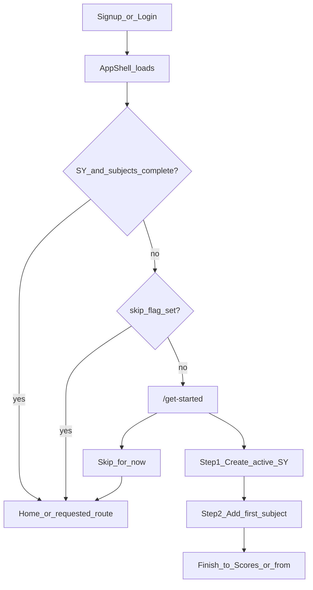

# Get Started Set Up — function documentation

**Get Started Set Up** is a guided, skippable onboarding flow for teachers who have signed up but have not yet configured the minimum data required to record grades: an **active school year** and **at least one registered subject**.

It closes **GAP-016** and advances the **“Zero setup”** spec item in [Spec-Align-Doc.md](./Spec-Align-Doc.md) (§2 Teacher-first design).

**Related:** [Subject-Function-Doc.md](./Subject-Function-Doc.md) · [Authentication-Function.md](./Authentication-Function.md) · [Home-Page-Doc.md](./Home-Page-Doc.md) · [Gap-Backlog-Doc.md](./Gap-Backlog-Doc.md) · [Quiz-Function-Doc.md](./Quiz-Function-Doc.md)

**Status:** Shipped (GSS-001)

---

## Problem

After signup or login, teachers land on [Home](./Home-Page-Doc.md) with no guidance. Attendance and classes work immediately, but **Scores** is blocked until the teacher discovers `/subjects`, creates an active school year, and registers subjects manually. The API enforces this chain (see [subjects.md](../schemas/subjects.md)); the gap is **UX**, not data model.

---

## v1 scope

| In scope | Out of scope (v1) |
|----------|-------------------|
| Active school year creation (sensible default label) | Class creation |
| Add at least one subject (name + grade level) | Student import |
| Skippable redirect after auth when incomplete | Excel import on this screen |
| Route `/get-started` + route guard | DueList `SETUP_DUE` nudges (GAP-021) |
| Client-side skip flag (`localStorage`) | `users.onboarding_completed_at` column |
| Reuse existing school-year / subject APIs | Mandatory hard gate (attendance must work after skip) |

---

## Completion rule

Setup is **complete** when:

1. `GET /api/school-years/active` returns a school year, **and**
2. `GET /api/school-years/:id/subjects` returns **≥ 1** registration for that year.

No server-side onboarding flag in v1 — completion is **derived** from existing data.

---

## User flow

```text
Signup / Login
      │
      ▼
AppShell loads ──► SY + subjects complete? ──yes──► Home (or requested route)
      │                      │
      │                      no
      │                      ▼
      │              skip flag set? ──yes──► Home (or requested route)
      │                      │
      │                      no
      │                      ▼
      │              /get-started
      │                 Step 1: Create active school year
      │                 Step 2: Add first subject
      │                      │
      │            ┌─────────┴─────────┐
      │            ▼                   ▼
      │         Finish            Skip for now
      │            │                   │
      └────────────┴───────────────────┘
                   ▼
            Home or /scores
```



---

## Product behavior

### When the flow appears

- After **signup** or **login**, when the teacher enters the authenticated app shell and setup is incomplete.
- `RequireGetStartedSetUp` redirects to `/get-started` unless the teacher has previously tapped **Skip for now**.

### Skip for now

- Sets `localStorage` key `tdtd:get-started-skipped` scoped by `user.id`.
- Teacher can use Home, attendance, classes, and all other routes freely.
- Skip flag is **cleared** when the completion rule becomes true (e.g. teacher finishes setup via `/subjects` later).
- Skip persists across sessions until cleared or setup completes.

### Step 1 — School year

- If no active school year: show suggested label from `defaultSchoolYearLabel()` (Philippine SY convention) and **Create active school year** button.
- If active year already exists (partial setup): show read-only badge and advance to step 2.

### Step 2 — First subject

- Inline form: subject name, grade level (required), short code (optional).
- **Finish** enabled when ≥ 1 subject is registered for the active year.
- On **Finish**: clear skip flag, navigate to `location.state.from` or `/scores`.

### What does not change

- `/subjects` remains the full subject-management UI after setup.
- Scores page still links to `/subjects` for ongoing subject management; also links to `/get-started` when no subjects exist.

---

## API (reuse only — no new endpoints in v1)

| Method | Path | Purpose in this flow |
|--------|------|----------------------|
| GET | `/api/school-years/active` | Detect active year (`404` = step 1 needed) |
| POST | `/api/school-years` | Create year with `{ label, setActive: true }` |
| GET | `/api/school-years/:id/subjects` | Count registrations; list after add |
| POST | `/api/school-years/:id/subjects` | Register first subject |

---

## Frontend architecture

```text
App.tsx
  RequireAuth
    RequireFreshPassword
      RequireGetStartedSetUp  ◄── useGetStartedStatus + getStartedSkip
        AppShell
          /get-started  →  GetStartedSetUp.tsx
          /  … other routes
```

| Module | Role |
|--------|------|
| `useGetStartedStatus` | Fetches active year + subject list; exposes `isComplete` |
| `getStartedSkip.ts` | `isSkipped(userId)`, `setSkipped(userId)`, `clearSkipped(userId)` |
| `RequireGetStartedSetUp` | Redirect guard (modeled on `RequireFreshPassword`) |
| `GetStartedSetUp` | Two-step wizard page |

---

## Out of v1 / future

- **GAP-021** — DueList kind `SETUP_DUE` (“Finish get started set up”) on Home when incomplete and not skipped.
- Optional `GET /api/get-started/status` to collapse two round-trips into one.
- Class + student steps in the wizard.
- Auto-create school year on signup (wizard stays explicit but guided).

---

## Entry GSS-001 — Get Started Set Up flow

**Date:** 2026-07-10

**Summary:** Skippable two-step onboarding at `/get-started`: create active school year, register first subject; route guard redirects incomplete teachers after auth.

**Reason:** New teachers could sign up and use attendance but hit a dead end on Scores with no guidance. GAP-016 targets reduced school-year setup friction toward “zero setup” without changing the underlying subject/school-year model.

**What changed:**

- **Doc:** This file; index and backlog cross-links.
- **Guard:** `RequireGetStartedSetUp` wraps `AppShell`; allows `/get-started` and skipped/complete states through.
- **Page:** `GetStartedSetUp` — step 1 school year, step 2 inline subject form, Finish + Skip for now.
- **Hook:** `useGetStartedStatus` — derived completion from existing APIs.
- **Skip:** `getStartedSkip` localStorage helpers keyed by `user.id`.
- **Scores:** Empty subject state links to `/get-started` in addition to `/subjects`.

**Files involved:**

- `.cursor/documentation/Get-Started-Set-Up.md`
- `.cursor/documentation/README.md`
- `.cursor/documentation/Gap-Backlog-Doc.md`
- `.cursor/documentation/Subject-Function-Doc.md`
- `tdtd-frontend/src/hooks/useGetStartedStatus.ts`
- `tdtd-frontend/src/lib/getStartedSkip.ts`
- `tdtd-frontend/src/components/RequireGetStartedSetUp/RequireGetStartedSetUp.tsx`
- `tdtd-frontend/src/pages/GetStartedSetUp/GetStartedSetUp.tsx`
- `tdtd-frontend/src/App.tsx`
- `tdtd-frontend/src/pages/Scores/Scores.tsx`

**Schemas involved:**

- [subjects.md](../schemas/subjects.md) — `school_years`, `school_year_subjects`, `subjects`
