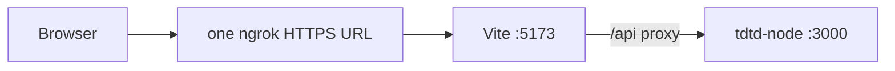
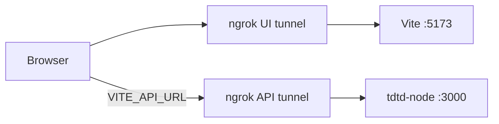

# Ngrok demo — share TDTD on the public internet (local machine)

Use [ngrok](https://ngrok.com/) to expose a **running local** copy of Teacher's Dilemma Today to phones or colleagues. This is a **temporary tunnel**, not production hosting. Your PC must stay on with the API and frontend running.

**Recommended on ngrok free tier:** **Option A** (one tunnel to Vite) — one public URL; Vite proxies `/api` to localhost:3000.

**Option B** (separate API + UI URLs) only works when ngrok gives you **two different** forwarding hostnames (often requires a paid plan). If both tunnels show the **same** URL, use Option A below.

---

## Prerequisites

- [ngrok](https://ngrok.com/download) installed and authenticated (`ngrok config add-authtoken …`)
- Node.js (same as project CI)
- API built at least once:

```bash
cd tdtd-node
npm install
npm run build
```

---

## Option A — one tunnel (recommended on free ngrok)



One public URL is enough: the browser only talks to Vite; Vite forwards `/api/*` to the API on your machine ([`vite.config.js`](../../tdtd-frontend/vite.config.js)).

### Steps

1. Start the API:

   ```bash
   cd tdtd-node
   npm start
   ```

2. Configure the frontend for the proxy (required for ngrok — do **not** leave the dev default `127.0.0.1:3000`):

   ```bash
   cd tdtd-frontend
   cp .env.example .env.local
   ```

   In `.env.local`:

   ```env
   VITE_API_URL=
   ```

   (Empty value — same as Option A in [`.env.example`](../../tdtd-frontend/.env.example).)

3. Start Vite:

   ```bash
   npm run dev
   ```

4. One ngrok tunnel to the **UI** port only:

   ```bash
   ngrok http 5173
   ```

5. Open the **single** HTTPS URL ngrok prints. Share that link only.

### Verify

- Home loads; Network tab shows requests to `/api/...` on the **same** ngrok host (not `127.0.0.1`).
- Saving attendance or creating a class works.

### Terminals (Windows)

```powershell
# 1 — API
cd tdtd-node; npm start

# 2 — UI
cd tdtd-frontend; npm run dev

# 3 — ngrok (repo not required)
ngrok http 5173
```

---

## Option B — two tunnels (only if you get two different URLs)



### 1. Start the API

```bash
cd tdtd-node
npm start
```

Listens on **http://localhost:3000**. SQLite database: `tdtd-node/data/teacher_app.sqlite` (created on first run).

### Why two terminals often fail on free ngrok

The free plan includes **one** dev domain (e.g. `something.ngrok-free.dev`). Two tunnels may:

- Reuse the **same** forwarding URL (only one port wins — you see `GET / 404` if that URL points at the API), or
- Fail with `ERR_NGROK_334` if you start two separate `ngrok http` processes.

You need **two distinct HTTPS hostnames** for Option B. If ngrok shows the same URL for `tdtd-api` and `tdtd-web`, **use Option A** instead.

### 2. Start both tunnels in one ngrok process (paid / multi-endpoint plans)

1. Stop any running ngrok (`Ctrl+C` or `taskkill /IM ngrok.exe /F` on Windows).
2. From the **repo root**, with API and Vite already running:

```bash
ngrok start --config "%LocalAppData%\ngrok\ngrok.yml" --config ngrok.tdtd.example.yml tdtd-api tdtd-web
```

PowerShell:

```powershell
ngrok start --config "$env:LOCALAPPDATA\ngrok\ngrok.yml" --config ngrok.tdtd.example.yml tdtd-api tdtd-web
```

Tunnel definitions live in [`ngrok.tdtd.example.yml`](../../ngrok.tdtd.example.yml) (ports 3000 and 5173). Your authtoken stays in the default ngrok config from `ngrok config add-authtoken`.

3. In the ngrok terminal you will see **two** HTTPS URLs:
   - **`tdtd-api`** → API base for `VITE_API_URL`
   - **`tdtd-web`** → URL you open / share in the browser

On the free tier hostnames may change each session unless you use a [reserved domain](https://ngrok.com/docs/guides/how-to-set-up-a-custom-domain/).

<details>
<summary>Legacy: two separate <code>ngrok http</code> terminals</summary>

Only use this if your ngrok plan allows multiple independent agents without a shared dev domain.

```bash
ngrok http 3000   # terminal A — API URL
ngrok http 5173   # terminal B — UI URL
```

If you see `ERR_NGROK_334`, switch to the single-agent command above.
</details>

### 3. Point the frontend at the API tunnel

```bash
cd tdtd-frontend
cp .env.example .env.local
```

Edit `.env.local` (gitignored):

```env
VITE_API_URL=https://abc123.ngrok-free.app
```

Replace with the **`tdtd-api`** HTTPS URL from step 2.

Restart Vite after changing env vars.

### 4. Start the frontend

```bash
cd tdtd-frontend
npm install
npm run dev
```

Note the dev port (usually **5173**). It must match `tdtd-web` in `ngrok.tdtd.example.yml`.

### 5. Open the UI tunnel URL

Use the **`tdtd-web`** HTTPS URL from the ngrok terminal (not the API URL).

### PowerShell quick reference (Windows)

```powershell
# Terminal 1 — API
cd tdtd-node; npm start

# Terminal 2 — UI (set .env.local with tdtd-api URL first, then:)
cd tdtd-frontend; npm run dev

# Terminal 3 — both tunnels (repo root)
cd <repo-root>
ngrok start --config "$env:LOCALAPPDATA\ngrok\ngrok.yml" --config ngrok.tdtd.example.yml tdtd-api tdtd-web
```

### Verify

1. Open the **UI** ngrok URL in a browser (or on another device on the internet).
2. Home loads without endless errors.
3. In DevTools → Network, API requests go to your **API** ngrok host (not `127.0.0.1:3000`).
4. Smoke test: create a class or save attendance — data should persist in local SQLite.

### How it works in code

- [`tdtd-frontend/src/lib/http.ts`](../../tdtd-frontend/src/lib/http.ts) uses `VITE_API_URL` when set (strips trailing slashes).
- [`tdtd-node/src/app.ts`](../../tdtd-node/src/app.ts) enables `cors({ origin: true })`, so the UI ngrok origin may call the API ngrok origin.

---

## Option A vs B

**Do not mix** Option A and Option B in the same session.

| | Option A (free tier) | Option B |
|---|----------------------|----------|
| ngrok | 1 tunnel → Vite `:5173` | 2 tunnels → `:3000` + `:5173` |
| Public URLs | **One** | **Two different hostnames** required |
| `VITE_API_URL` | Empty: `VITE_API_URL=` | API tunnel HTTPS URL |
| API traffic | Vite proxy `/api` → `localhost:3000` | Browser → API ngrok host |

---

## Caveats

- **Not permanent hosting** — tunnel stops when ngrok or your machine stops.
- **Local data only** — SQLite lives on your machine; not shared across servers.
- **No authentication** — anyone with the UI link can use the app; use only for trusted demos.
- **Free ngrok** — visitors may see an ngrok browser warning page before the app.
- **Production builds** — this guide targets **Vite dev**. Serving `dist/` through ngrok needs a static server plus correct `VITE_API_URL` at build time (out of scope here).

---

## Troubleshooting

| Symptom | Likely cause | Fix |
|---------|----------------|-----|
| API calls go to `127.0.0.1:3000` from a remote device | `VITE_API_URL` not set; dev default in `http.ts` | Set API ngrok URL in `.env.local`, restart `npm run dev` |
| CORS errors | Wrong URL or API not running | Confirm API tunnel targets port 3000 and `npm start` is up |
| UI loads but all requests fail | API tunnel down or wrong `VITE_API_URL` | Match `.env.local` to current API ngrok HTTPS URL |
| Changes to `.env.local` ignored | Vite caches env at startup | Stop and restart `npm run dev` |
| `Blocked request. This host … is not allowed` | Vite host check | Restart dev server; [`vite.config.js`](../../tdtd-frontend/vite.config.js) allows `*.ngrok-free.*` / `*.ngrok.io` |
| `ERR_NGROK_334` endpoint already online | Two `ngrok http` on free tier | Use **Option A**: one `ngrok http 5173` + `VITE_API_URL=` |
| Same forwarding URL for api and web | Free tier single dev domain | Use **Option A** (one URL + Vite proxy) |
| `GET / 404` in ngrok log | Browser hit **API** tunnel or API-only URL | Open the **web** URL (Option A: the only URL; Option B: `tdtd-web` host) |

---

## Related

- Tunnel config: [`ngrok.tdtd.example.yml`](../../ngrok.tdtd.example.yml)
- Env template: [`tdtd-frontend/.env.example`](../../tdtd-frontend/.env.example)
- Frontend README: [`tdtd-frontend/README.md`](../../tdtd-frontend/README.md)
