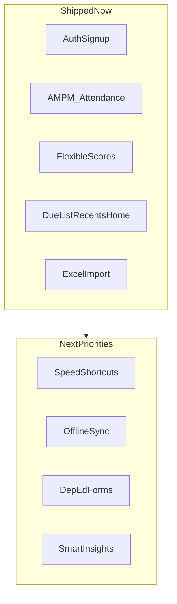

# Product spec alignment

Maps the **teacher-first product checklist** (12 areas + four priority differentiators) to what **Teacher's Dilemma Today (TDTD)** ships today versus what is scaffolded, planned, or not started.

**Related:** [Gap-Backlog-Doc.md](./Gap-Backlog-Doc.md) · [Mobile-App-Version-Plan.md](./Mobile-App-Version-Plan.md) · [Due-List-Function-Doc.md](./Due-List-Function-Doc.md) · [MH-Mobile-App-Deployment.md](../must-haves/MH-Mobile-App-Deployment.md) · [Authentication-Function.md](./Authentication-Function.md) · [Attendance-Function-Doc.md](./Attendance-Function-Doc.md) · [Quiz-Function-Doc.md](./Quiz-Function-Doc.md) · [Student-Lab-Function-Doc.md](./Student-Lab-Function-Doc.md) · [TDTD-Batch-Function.md](./TDTD-Batch-Function.md) · [Classes-Function-Doc.md](./Classes-Function-Doc.md) · [Subject-Function-Doc.md](./Subject-Function-Doc.md) · [Home-Page-Doc.md](./Home-Page-Doc.md)

**Status:** Living doc · **Last reviewed:** 2026-06-07

---

## Status legend

| Status | Meaning |
|--------|---------|
| **Shipped** | Available in the current web app (or batch/server companion) |
| **Partial** | Some capability exists; spec item not fully met |
| **Scaffold** | Code or schema exists; not usable end-to-end |
| **Planned** | Documented in an existing roadmap or function doc |
| **Not started** | No meaningful implementation yet |

---

## Executive summary

**Overall alignment:** ~**35–40%** of the full 12-point checklist is shipped. Product **direction** aligns with the vision; headline **differentiators** are mostly ahead of current delivery, not behind the stated intent.

**Verdict:** TDTD is **beyond plain CRUD** — it has workflow layers (Home dashboard, DueList, Recents, Student Lab, batch reminders, Excel import). It is **not yet** the combination of fast, offline, DepEd-automated, and smart that would be hard to find in one tool today.

### Four priority differentiators

| Differentiator | Status | Notes |
|----------------|--------|-------|
| **Speed** (faster than Excel) | **Partial** | Attendance has Select all and Home deep links; scores and attendance still use explicit Save buttons and multi-step flows |
| **Offline-first** | **Scaffold** | Capacitor shell, sync routes, outbox — not usable offline; see [Mobile-App-Version-Plan.md](./Mobile-App-Version-Plan.md) |
| **DepEd automation** | **Partial** | Grading engine MVP (GAP-080–082); SF forms shipped; final grade/rank deferred — [DepEd-Grading-Engine-Function-Doc.md](./DepEd-Grading-Engine-Function-Doc.md) |
| **Smart insights** | **Partial** | Student Lab summary stats only; no at-risk, trends, or AI layer |

---

## 1. Speed and workflow optimization

| Spec item | Status | Evidence in TDTD |
|-----------|--------|------------------|
| One-tap attendance | **Not started** | Flow: pick class → load roster → checkboxes → **Save attendance** — [`AttendanceSession.tsx`](../../tdtd-frontend/src/pages/AttendanceSession/AttendanceSession.tsx) |
| “Mark all present except…” shortcut | **Partial** | **Select all / Clear all** marks every student present or absent (present-only model: unchecked = absent); no “all except these N” shortcut — same file |
| Bulk edit multiple students | **Not started** | Bulk **import** only via `POST /api/students/bulk` — [`Classes.tsx`](../../tdtd-frontend/src/pages/Classes/Classes.tsx), [`RegisterStudentsModal.tsx`](../../tdtd-frontend/src/components/RegisterStudentsModal/RegisterStudentsModal.tsx) |
| Keyboard-first input (type → Enter → next) | **Not started** | No score or attendance keyboard navigation flow |
| Paste-from-Excel for scores | **Not started** | Excel import exists for **students** and **subjects** only |
| Instant auto-save (no submit buttons) | **Not started** | Explicit save on attendance and scores — [`AttendanceSession.tsx`](../../tdtd-frontend/src/pages/AttendanceSession/AttendanceSession.tsx), [`ScoreGrading.tsx`](../../tdtd-frontend/src/pages/ScoreGrading/ScoreGrading.tsx) |

**Partial wins:** [`Home.tsx`](../../tdtd-frontend/src/pages/Home/Home.tsx) **TodayAttendanceCTA** deep-links to today’s session; attendance checkboxes use `touch-manipulation`; inline roster setup from the attendance screen.

---

## 2. Teacher-first design (instead of admin-first)

| Spec item | Status | Evidence in TDTD |
|-----------|--------|------------------|
| Zero setup (no admin required) | **Partial** | Self **signup/login** (AUTH-001) — [Authentication-Function.md](./Authentication-Function.md); school year + subject registration still required before scoring |
| Create class → start immediately | **Shipped** | `/classes` and `RegisterStudentsModal` from attendance — [Classes-Function-Doc.md](./Classes-Function-Doc.md) |
| Flexible grading system (not rigid templates) | **Shipped** | `QUIZ` / `EXAM` / `PARTICIPATION`, custom titles, optional `maxScore` — [quiz.md](../schemas/quiz.md), [Quiz-Function-Doc.md](./Quiz-Function-Doc.md) |
| Editable anytime without restrictions | **Shipped** | Past attendance dates; score **Edit Changes** mode — [Quiz-Function-Doc.md](./Quiz-Function-Doc.md) QUIZ-004 |
| Personal workspace per teacher | **Not started** | `classes` / `students` have **no `userId`**; one shared SQLite DB per deployment — [core.md](../schemas/core.md) |

---

## 3. Offline-first capability

| Spec item | Status | Evidence in TDTD |
|-----------|--------|------------------|
| Fully usable without internet | **Not started** | Web build is online-only REST → server SQLite |
| Local data storage (device-first) | **Scaffold** | [`tdtd-frontend/src/mobile/db/`](../../tdtd-frontend/src/mobile/db/), [`connection.ts`](../../tdtd-frontend/src/mobile/db/connection.ts) — gated by `isOfflineCapable()` |
| Sync when online | **Scaffold** | `GET /api/sync/pull`, `POST /api/sync/push`; client [`syncClient.ts`](../../tdtd-frontend/src/mobile/sync/syncClient.ts) — [sync.md](../schemas/sync.md) |
| Conflict resolution | **Planned** | Last-write-wins documented in [sync.md](../schemas/sync.md); not wired to domain tables |

**Note:** [`sync.service.ts`](../../tdtd-node/src/services/sync.service.ts) `pullSync` returns **empty `changes`**; `pushSync` accepts idempotency keys but does **not apply** mutations. See [Mobile-App-Version-Plan.md](./Mobile-App-Version-Plan.md) Phases 4–5 and [MH-Mobile-App-Deployment.md](../must-haves/MH-Mobile-App-Deployment.md) §D.

---

## 4. Smart insights (AI / automation layer)

| Spec item | Status | Evidence in TDTD |
|-----------|--------|------------------|
| Auto-detect failing students | **Not started** | — |
| Performance trend tracking | **Not started** | — |
| “At-risk” alerts | **Not started** | — |
| Class average insights per quiz | **Not started** | — |
| Suggested interventions / AI hints | **Not started** | — |
| Auto-generate report card comments | **Not started** | — |
| Natural language summaries | **Not started** | — |

**Closest shipped feature:** [Student-Lab-Function-Doc.md](./Student-Lab-Function-Doc.md) — per-student attendance summary (present / absent / rate) and score lists in [`StudentLab.tsx`](../../tdtd-frontend/src/pages/StudentLab/StudentLab.tsx). Summary **stats**, not insight or AI.

---

## 5. DepEd painkillers

| Spec item | Status | Evidence in TDTD |
|-----------|--------|------------------|
| One-click SF1, SF2, SF4, SF5, SF9, SF10 generation | **Shipped** | [DepEd-School-Forms-Function-Doc.md](./DepEd-School-Forms-Function-Doc.md); batch jobs REP-004–REP-010; `GET /api/reports/*` |
| Auto-fill report cards from encoded data | **Shipped** | GAP-085 — Reports page pre-fills from `computed_subject_grades` |
| Quarter-based grading automation | **Partial** | GAP-082 MVP — quarter compute works when events have quarter+bucket; calendar config deferred |
| Built-in DepEd grading logic (WW/PT/QA weights) | **Partial** | GAP-080–081 MVP — bucket on create, official transmutation; configurable weights deferred |
| Export-ready PDF/Excel (DepEd formats) | **Shipped** | [Report-Generation-Function-Doc.md](./Report-Generation-Function-Doc.md) REP-004–REP-010 |
| LRN, address, parent info, school metadata | **Shipped** | GAP-087 — extended `students`, `school_settings`, [deped-forms.md](../schemas/deped-forms.md) |
| DepEd attendance codes (absent/late/excused) | **Shipped** | GAP-088 — `daily_attendance_records` |

---

## 6. True mobile-first UX (not just responsive)

| Spec item | Status | Evidence in TDTD |
|-----------|--------|------------------|
| Tap-based attendance (fast UI) | **Partial** | Checkbox roster with touch targets — ATT-002 in [Attendance-Function-Doc.md](./Attendance-Function-Doc.md) |
| Swipe gestures (present/absent) | **Not started** | — |
| Quick score entry via numeric keypad | **Not started** | Generic text inputs in [`ScoreGrading.tsx`](../../tdtd-frontend/src/pages/ScoreGrading/ScoreGrading.tsx) |
| Offline mobile app experience | **Scaffold** | Capacitor in [`capacitor.config.ts`](../../tdtd-frontend/capacitor.config.ts); offline product not shipped |
| Notion / Sheets-smooth data entry | **Partial** | Good UI polish (skeletons, content reveal, Home layout) — still form + submit patterns |

---

## 7. Interoperability (real teacher habits)

| Spec item | Status | Evidence in TDTD |
|-----------|--------|------------------|
| Import from Excel (CSV, XLSX) | **Shipped** | Students: [`Classes.tsx`](../../tdtd-frontend/src/pages/Classes/Classes.tsx), [`studentImportParse.ts`](../../tdtd-frontend/src/lib/studentImportParse.ts); subjects: [Subject-Function-Doc.md](./Subject-Function-Doc.md) SUB-002 |
| Export to Excel anytime | **Not started** | Sample `.xlsx` **downloads** for import templates only — [`studentImportSampleXlsx.ts`](../../tdtd-frontend/src/lib/studentImportSampleXlsx.ts) |
| Copy/paste grade tables | **Not started** | — |
| Backup/restore data easily | **Not started** | — |
| Sync across devices (phone ↔ laptop) | **Scaffold** | Sync API + outbox; not end-to-end — see §3 |

---

## 8. Flexible real-world workflow support

| Spec item | Status | Evidence in TDTD |
|-----------|--------|------------------|
| Encode now, finalize later | **Shipped** | Nullable scores (`score_entries.score` can be null) — [quiz.md](../schemas/quiz.md) |
| Partial grading (incomplete data allowed) | **Shipped** | Save with some scores empty — [`ScoreGrading.tsx`](../../tdtd-frontend/src/pages/ScoreGrading/ScoreGrading.tsx) |
| Edit past records easily | **Shipped** | Attendance by calendar date; scores via edit mode |
| No forced “submission states” | **Shipped** | No lock/finalize workflow |
| Handle messy real-life data (late entries, changes) | **Partial** | Supported in practice; no dedicated “late entry” UX |

**Strongest alignment area** in the full checklist.

---

## 9. Student performance visualization

| Spec item | Status | Evidence in TDTD |
|-----------|--------|------------------|
| Visual dashboards per student | **Partial** | Student Lab stat cards + lists — [Student-Lab-Function-Doc.md](./Student-Lab-Function-Doc.md) |
| Class heatmaps (failing/passing) | **Not started** | — |
| Ranking per quarter | **Not started** | — |
| Progress graphs per subject | **Not started** | — |

Most tools show **tables**; TDTD shows tables plus small summary stat blocks — not charts or heatmaps.

---

## 10. Smart notifications / reminders

| Spec item | Status | Evidence in TDTD |
|-----------|--------|------------------|
| “You haven’t encoded grades for this class” | **Planned** | Listed under “Out of v1” in [Due-List-Function-Doc.md](./Due-List-Function-Doc.md) |
| “Quarter deadline approaching” | **Not started** | — |
| “3 students are at risk” | **Not started** | — |
| “Take AM/PM attendance” / missed sessions | **Shipped** | DueList, Home, `/due-list`, missed-work summary — [Due-List-Function-Doc.md](./Due-List-Function-Doc.md), [Home-Page-Doc.md](./Home-Page-Doc.md); batch jobs — [TDTD-Batch-Function.md](./TDTD-Batch-Function.md) |

Mobile **local** notifications remain planned in [Mobile-App-Version-Plan.md](./Mobile-App-Version-Plan.md).

---

## 11. Modular / lightweight system

| Spec item | Status | Evidence in TDTD |
|-----------|--------|------------------|
| Attendance-only or grading-only modules | **Not started** | Full app shell required: classes, subjects, school year, scores, attendance, Student Lab, etc. |

Existing tools are “all or nothing”; TDTD currently matches that pattern.

---

## 12. Personal ownership of data

| Spec item | Status | Evidence in TDTD |
|-----------|--------|------------------|
| Teacher owns their data (not locked to school system) | **Partial** | Individual **accounts** (AUTH-001); domain data **not scoped per user** yet |
| Easy export when transferring schools | **Not started** | — |
| Personal backup | **Not started** | — |

Per-teacher / IDOR scoping called out as TODO in [MH-Mobile-App-Deployment.md](../must-haves/MH-Mobile-App-Deployment.md) §A4.

---

## What already aligns (strengths)

- **Teacher workflow layer** — Home answers “what should I do now?”; DueList + batch reminders; Recents as history — [Home-Page-Doc.md](./Home-Page-Doc.md), [Due-List-Function-Doc.md](./Due-List-Function-Doc.md), [Recents-Function-Doc.md](./Recents-Function-Doc.md)
- **PH-shaped attendance** — AM/PM sessions, MRNG/AFTNN shift model, `Asia/Manila` timezone, missed-work tracking — [Attendance-Function-Doc.md](./Attendance-Function-Doc.md)
- **Flexible scoring + partial grading** — events, nullable entries, edit mode — [Quiz-Function-Doc.md](./Quiz-Function-Doc.md)
- **Excel-friendly onboarding** — roster and subject import — [Classes-Function-Doc.md](./Classes-Function-Doc.md), [Subject-Function-Doc.md](./Subject-Function-Doc.md)
- **Student-centric view** — Student Lab read model — [Student-Lab-Function-Doc.md](./Student-Lab-Function-Doc.md)
- **Auth + explicit mobile/offline roadmap** — [Authentication-Function.md](./Authentication-Function.md), [Mobile-App-Version-Plan.md](./Mobile-App-Version-Plan.md)

---

## Gap map (priority backlog)

**Actionable backlog:** [Gap-Backlog-Doc.md](./Gap-Backlog-Doc.md) — prioritized `GAP-###` items mapped 1:1 to existing plan docs (Mobile-App-Version-Plan, Due-List-Function-Doc, MH-Mobile-App-Deployment, schema futures).



| Gap cluster | Where already planned |
|-------------|----------------------|
| Offline + sync | [Mobile-App-Version-Plan.md](./Mobile-App-Version-Plan.md) Phases 4–5; [MH-Mobile-App-Deployment.md](../must-haves/MH-Mobile-App-Deployment.md) §D |
| Speed (auto-save, keyboard-first, paste grades) | **TBD epic** — not yet in a dedicated plan doc |
| DepEd forms (SF1/SF9/SF10, WW/PT/QA, quarters) | Schema future extensions in [core.md](../schemas/core.md), [quiz.md](../schemas/quiz.md); **TBD epic** |
| Per-teacher data scope + export/backup | [MH-Mobile-App-Deployment.md](../must-haves/MH-Mobile-App-Deployment.md) §A4 (IDOR) |
| More DueList kinds (grades due, setup, past attendance) | [Due-List-Function-Doc.md](./Due-List-Function-Doc.md) “Out of v1” |
| Smart insights / at-risk | **TBD epic** — extend Student Lab or new service layer |

### Shipped vs next (quick reference)

```text
SHIPPED NOW          SCAFFOLD / PLANNED       NOT STARTED
─────────────────────────────────────────────────────────────
Auth/signup          Capacitor shell          DepEd forms
AM/PM attendance     Sync API + outbox        AI / at-risk insights
Scores (flexible)    Mobile app target        Grade export / backup
Excel import         Offline plan docs        Speed shortcuts
DueList/reminders    Per-teacher data scope   Modular modules
Recents              More DueList kinds       Swipe / keypad UX
Home dashboard
Partial grading
Student Lab stats
```

---

## Maintenance

- **Update when:** a shipped feature closes a checklist row; or at quarterly product review.
- **Review entries:** use ids `ALIGN-001`, `ALIGN-002`, … at the bottom of this file (snapshots only — not function changelogs).
- **Do not duplicate:** canonical table definitions stay in [`.cursor/schemas/`](../schemas/); feature history stays in `*-Function-Doc.md` files.

---

## Entry ALIGN-001 — Initial spec alignment audit

**Date:** 2026-06-07

**Summary:** First full pass mapping the 12-point teacher-tool product checklist and four priority differentiators to shipped TDTD features, scaffolds, and existing plan docs.

**Reason:** Product direction (fast, offline, smart, teacher-first) needed a durable repo-native reference so prioritization and agent context stay aligned with reality — not aspiration alone.

**What changed:**

- Added this file with status legend, 12 checklist sections, executive summary, gap map, and maintenance rules.
- Linked evidence to function docs, schema files, and key source paths.

**Checklist rows affected:** All 12 sections + four priority differentiators (baseline audit).

**Files involved:**

- `.cursor/documentation/Spec-Align-Doc.md`
- `.cursor/documentation/README.md` (index row)
