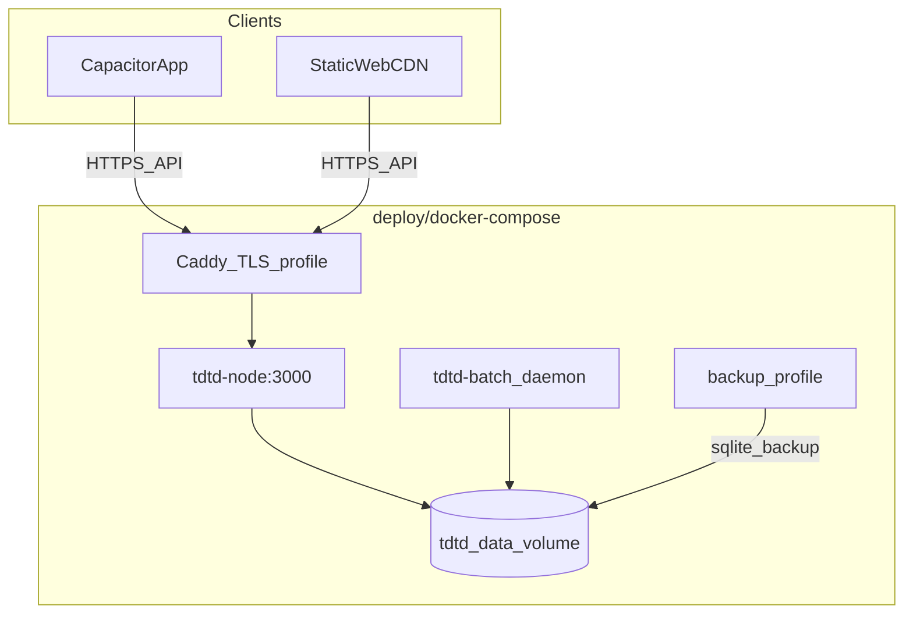

# GAP-003 — Production deployment (reference stack)

**Priority:** P0 · **Status:** In progress · **Depends:** GAP-002 (recommended before public exposure) · **Unblocks:** GAP-004 (partial), GAP-005, GAP-024, GAP-042, MH §A1

**Related:** [Gap-Backlog-Doc.md](../documentation/Gap-Backlog-Doc.md) · [MH-Mobile-App-Deployment.md](../must-haves/MH-Mobile-App-Deployment.md) §A1, §A4, §A8, §A10 · [Mobile-App-Version-Plan.md](../documentation/Mobile-App-Version-Plan.md) Phase 1 · [TDTD-Batch-Function.md](../documentation/TDTD-Batch-Function.md) · [deploy/README.md](../../deploy/README.md)

---

## Problem statement

TDTD CI produces build artifacts, but there is no runnable production stack in the repo. Mobile sync, secure auth, and multi-device use all assume a reachable **HTTPS API** with a **persistent, backed-up** database. Without that, the product remains a local demo.

| Area | Today |
|------|-------|
| CI | [`build-artifacts.yml`](../../.github/workflows/build-artifacts.yml) builds node, frontend, batch JAR |
| Deploy | [`deploy-production.yml`](../../.github/workflows/deploy-production.yml) / [`deploy-staging.yml`](../../.github/workflows/deploy-staging.yml) are placeholders ("Docker later") |
| Docker | No Dockerfile or compose (until this epic) |
| HTTPS | Documented as required; not configured in repo |
| DB persistence | `TDTD_DB_PATH` env var exists; no volume mount / host path in deploy |
| Backups | Not implemented; mentioned as future batch job only |
| CORS | `cors({ origin: true })` — reflects any origin |
| Secrets | [`auth-config.ts`](../../tdtd-node/src/lib/auth-config.ts) falls back to dev placeholders if env vars unset; no `tdtd-node/.env.example` or documented dev/staging/prod matrix (GAP-004) |

**Architecture note:** `tdtd-node` does **not** serve the SPA. Capacitor bundles the UI; web needs separate static hosting. CI builds web only (`VITE_API_URL=""`), not `build:mobile`.

---

## Goal

Ship a **portable reference production stack** in-repo:

1. Docker Compose stack (`api` + `batch` + shared SQLite volume + optional TLS/backup profiles)
2. Documented **environment matrix** (`dev` / `staging` / `production`) — partial GAP-004
3. CORS allowlist + production secret fail-fast in `tdtd-node`
4. Clear path to wire CI deploy workflows when a hosting target is chosen

**This epic does not** provision a live host or wire GitHub deploy workflows yet.

---

## Boundary with GAP-004

| GAP-003 (this epic) | GAP-004 (backlog; partial here) |
|---|---|
| Runtime: Docker, volumes, backups, HTTPS termination pattern | CORS allowlist enforcement |
| `deploy/docker-compose.yml` reference stack | Secrets matrix + `tdtd-node/.env.example` |
| Batch + API share `TDTD_DB_PATH` on volume | Fail-fast if prod secrets missing |
| Backup script + restore procedure | Rate limiting (future) |

---

## Reference architecture



- **Shared volume:** `/data/teacher_app.sqlite` — same path for `tdtd-node` and `tdtd-batch`
- **Reports:** node spawns batch JAR on demand; API image includes JRE + shaded JAR at `/opt/tdtd/tdtd-batch-app.jar`
- **Health:** `GET /api/health` (unauthenticated)

---

## Environment matrix

**Canonical matrix:** [GAP-004.md](./GAP-004.md) §Track B — CORS allowlist + secrets matrix.

Copy [`tdtd-node/.env.example`](../../tdtd-node/.env.example) for local dev; use [`deploy/.env.example`](../../deploy/.env.example) for Compose.

---

## Reference stack files

| File | Purpose |
|------|---------|
| [`deploy/docker-compose.yml`](../../deploy/docker-compose.yml) | `api`, `batch`, optional `caddy` (profile `tls`), `backup` (profile `backup`) |
| [`tdtd-node/Dockerfile`](../../tdtd-node/Dockerfile) | Multi-stage: npm build + batch JAR + JRE for on-demand reports |
| [`tdtd-batch/Dockerfile`](../../tdtd-batch/Dockerfile) | Shaded JAR daemon |
| [`scripts/backup-sqlite.sh`](../../scripts/backup-sqlite.sh) | SQLite backup via `.backup` |
| [`deploy/Caddyfile.example`](../../deploy/Caddyfile.example) | TLS termination pattern |
| [`deploy/README.md`](../../deploy/README.md) | Local run, backup/restore smoke test |

### Compose services

- **`api`:** `tdtd-node`, binds `0.0.0.0:3000`, volume `tdtd_data:/data`, healthcheck on `/api/health`
- **`batch`:** `tdtd-batch` Quartz daemon, same volume, `depends_on: api`
- **`caddy`** (profile `tls`): reverse proxy; set `API_DOMAIN` in `.env`
- **`backup`** (profile `backup`): one-shot backup; schedule externally or run manually

---

## HTTPS

TLS is **not** terminated inside `tdtd-node`. Options:

1. **Compose profile `tls`:** Caddy in front of `api:3000` — see [`Caddyfile.example`](../../deploy/Caddyfile.example)
2. **Host-level:** nginx/Caddy on VPS, Railway/Fly edge TLS, school reverse proxy
3. **Local reference:** HTTP on port 3000 only (no TLS) — acceptable for smoke tests

Production mobile and web clients must use **HTTPS** API URLs (`VITE_API_URL`).

---

## Backups

[`scripts/backup-sqlite.sh`](../../scripts/backup-sqlite.sh):

- Uses `sqlite3 .backup` when available; falls back to checkpoint + copy
- Writes timestamped files to `TDTD_BACKUP_DIR` (default `/data/backups`)

**Manual run:**

```bash
docker compose -f deploy/docker-compose.yml --profile backup run --rm backup
```

**Restore (smoke test):**

1. Stop `api` and `batch`
2. Copy backup over `/data/teacher_app.sqlite`
3. Start services; verify `GET /api/health`

Automated cron on a real host is deferred until deploy workflows are wired (GAP-024 adjacent).

---

## Code changes (GAP-004 subset)

| File | Change |
|------|--------|
| [`cors-config.ts`](../../tdtd-node/src/lib/cors-config.ts) | Parse `TDTD_CORS_ORIGINS`; prod requires allowlist |
| [`auth-config.ts`](../../tdtd-node/src/lib/auth-config.ts) | `assertProductionSecrets()` — reject dev placeholders when `TDTD_ENV=production` |
| [`server.ts`](../../tdtd-node/src/server.ts) | Call assertions on boot; `listen(port, '0.0.0.0')` |
| [`app.ts`](../../tdtd-node/src/app.ts) | Use `getCorsMiddleware()` |

---

## CI / deploy (deferred)

| Workflow | Status |
|----------|--------|
| [`build-artifacts.yml`](../../.github/workflows/build-artifacts.yml) | Unchanged — web build only, no `build:mobile` |
| [`deploy-production.yml`](../../.github/workflows/deploy-production.yml) | Placeholder + comment → this epic |
| [`deploy-staging.yml`](../../.github/workflows/deploy-staging.yml) | Placeholder + comment → this epic |

**Future (when host chosen):** `docker build` / push, SSH or PaaS deploy, GitHub environment secrets, staging vs production URLs.

---

## Acceptance criteria

- [ ] `deploy/docker-compose.yml` starts `api` + `batch` with shared persistent volume
- [ ] `GET /api/health` returns 200 from composed stack
- [ ] `scripts/backup-sqlite.sh` produces a restorable backup file
- [ ] `TDTD_ENV=production` without secrets → process exits with clear error
- [ ] `TDTD_ENV=production` without `TDTD_CORS_ORIGINS` → process exits with clear error
- [ ] `tdtd-node/.env.example` documents all `TDTD_*` vars
- [ ] Env matrix documented in this doc matches `.env.example` files
- [ ] MH §A1 checkboxes can reference this epic for hosting/backup/docs
- [ ] Deploy workflows remain placeholders (no live host wiring)

---

## Out of scope

- Live CI deploy to VPS/PaaS
- Rate limiting (auth v2)
- GAP-004 mobile secure token storage + CORS/secrets closure → [GAP-004.md](./GAP-004.md)
- GAP-042 sync fan-out
- Serving SPA from `tdtd-node`
- `build:mobile` in CI (MH §A8 — manual until added)

---

## Changelog

| Date | Summary |
|------|---------|
| 2026-07-11 | Epic created; reference Docker stack, env matrix, CORS/secrets hardening |
