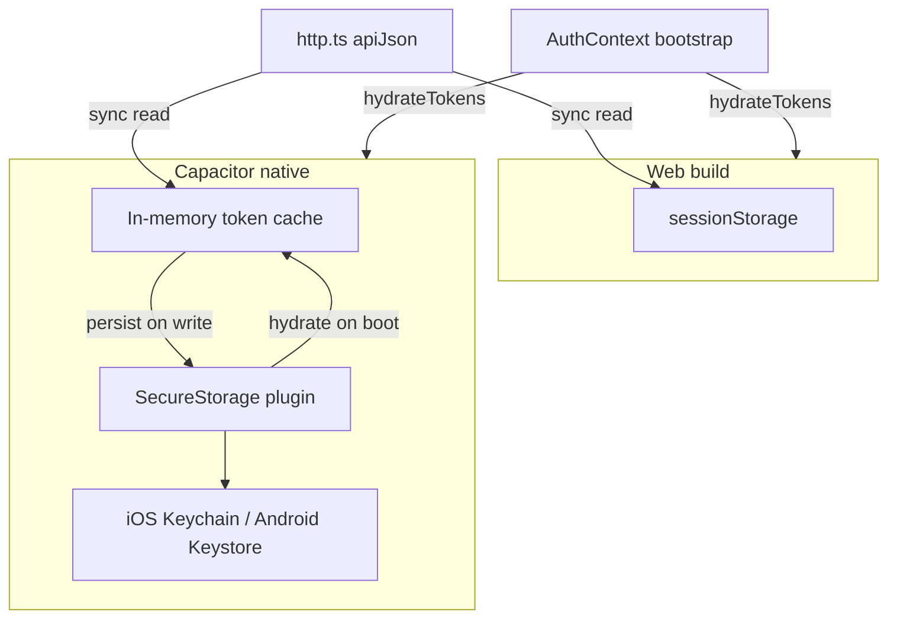

# GAP-004 — Mobile secure tokens + production API hardening

**Priority:** P0 · **Status:** In progress · **Depends:** [GAP-003](./GAP-003.md) (reference deploy stack) · **Unblocks:** MH §A3, MH §A4, Play Store online-only v1

**Backlog mapping:**

| Track | Global backlog ID | MH section |
|-------|-------------------|------------|
| A — Mobile secure token storage | GAP-005 | §A3 |
| B — CORS allowlist + secrets matrix closure | GAP-004 | §A4 |

**Related:** [Gap-Backlog-Doc.md](../documentation/Gap-Backlog-Doc.md) · [GAP-003.md](./GAP-003.md) · [MH-Mobile-App-Deployment.md](../must-haves/MH-Mobile-App-Deployment.md) §A3, §A4 · [Mobile-App-Version-Plan.md](../documentation/Mobile-App-Version-Plan.md) Phase 2 · [Authentication-Function.md](../documentation/Authentication-Function.md)

---

## Problem statement

### Track A — Mobile token storage

JWT access and refresh tokens are stored in WebView `sessionStorage` via [`authStorage.ts`](../../tdtd-frontend/src/lib/authStorage.ts). On Capacitor builds this is **not** Keychain (iOS) or Keystore (Android).

| Area | Today |
|------|-------|
| Storage | `sessionStorage` for all builds |
| Plugin | None (`@capacitor/preferences`, secure-storage not installed) |
| Platform branch | None — no `Capacitor.isNativePlatform()` |
| Persistence | Tokens lost on app kill / may not survive reboot |
| Security | Refresh tokens in non-secure storage on shared devices |

**Consumers:** [`AuthContext.tsx`](../../tdtd-frontend/src/contexts/AuthContext.tsx), [`http.ts`](../../tdtd-frontend/src/lib/http.ts), [`depedApi.ts`](../../tdtd-frontend/src/api/depedApi.ts).

### Track B — CORS + secrets

Production API hardening was **partially shipped** in GAP-003. Remaining work: canonical env matrix ownership, `auth-config` tests, and device-verified Capacitor CORS origins.

---

## Goal

**Track A:** On Capacitor native, persist tokens in hardware-backed secure storage. Web keeps `sessionStorage`.

**Track B:** Close production CORS allowlist + secrets documentation and verification so MH §A4 can be checked off.

---

## Boundary with other epics

| This epic | Other |
|-----------|-------|
| Track A — native token storage | GAP-042 offline sync (independent) |
| Track B — CORS/secrets closure | GAP-003 — Docker/deploy runtime |
| Track B — rate limiting | Auth v2 (future) |
| Track B — live CI deploy | GAP-024 |

---

## Track A — Mobile secure token storage

### Plugin

**`@aparajita/capacitor-secure-storage@^7.1.6`** — Capacitor 7, iOS Keychain + Android Keystore (AES-GCM).

**Not** `@capacitor/preferences` alone (not encrypted for secrets).

### Architecture



**Memory cache + async persist:**

1. `hydrateTokens()` — once at bootstrap; loads secure storage into cache on native
2. Sync getters — `getAccessToken()` / `getRefreshToken()` read cache (web: `sessionStorage`)
3. Async setters — `setTokens()` / `clearTokens()` update cache + persist
4. Runtime detection — `Capacitor.isNativePlatform()` for storage backend; `isMobileApp()` remains for feature flags

### Code changes (Track A)

| File | Change |
|------|--------|
| [`package.json`](../../tdtd-frontend/package.json) | Add `@aparajita/capacitor-secure-storage` |
| [`appTarget.ts`](../../tdtd-frontend/src/mobile/appTarget.ts) | Export `isNativePlatform()` |
| [`authStorage.ts`](../../tdtd-frontend/src/lib/authStorage.ts) | Hydrate/cache/persist; native vs web |
| [`AuthContext.tsx`](../../tdtd-frontend/src/contexts/AuthContext.tsx) | `await hydrateTokens()`; async `applySession` / logout |
| [`http.ts`](../../tdtd-frontend/src/lib/http.ts) | `await setTokens` / `await clearTokens` in refresh flow |
| [`ChangePassword.tsx`](../../tdtd-frontend/src/pages/ChangePassword/ChangePassword.tsx) | `await applySession(...)` |
| [`ResetPassword.tsx`](../../tdtd-frontend/src/pages/ResetPassword/ResetPassword.tsx) | `await applySession(...)` |
| [`authStorage.test.ts`](../../tdtd-frontend/src/lib/authStorage.test.ts) | Web + native branch tests |

### Migration

No `sessionStorage` → secure migration on native (sessionStorage did not persist across app kills). Users may need one re-login after upgrading to this build.

### Device test plan (Track A)

1. `npm run build:mobile && npx cap sync` → device build with `VITE_API_URL` pointing at HTTPS API
2. Login → API calls succeed
3. Force-kill app → reopen → still authenticated
4. Reboot device → still authenticated
5. Logout → secure storage cleared; reopen shows login

---

## Track B — CORS allowlist + secrets matrix

### Canonical environment matrix

Copy [`tdtd-node/.env.example`](../../tdtd-node/.env.example) for local dev; use [`deploy/.env.example`](../../deploy/.env.example) for Compose.

| Variable | dev | staging | production |
|----------|-----|---------|------------|
| `NODE_ENV` / `TDTD_ENV` | `development` (or unset) | `production` | `production` |
| `PORT` | `3000` | `3000` | `3000` |
| `TDTD_DB_PATH` | `data/teacher_app.sqlite` (cwd-relative) | `/data/teacher_app.sqlite` | `/data/teacher_app.sqlite` |
| `TDTD_JWT_ACCESS_SECRET` | dev placeholder OK | **required** (32+ random bytes) | **required** |
| `TDTD_REFRESH_TOKEN_PEPPER` | dev placeholder OK | **required** | **required** |
| `TDTD_CORS_ORIGINS` | unset → reflect all origins (ngrok/LAN) | comma-separated allowlist | comma-separated allowlist |
| `TDTD_APP_URL` | `http://localhost:5173` | staging web URL | production web URL |
| `TDTD_TIMEZONE` | `Asia/Manila` | `Asia/Manila` | `Asia/Manila` |
| `TDTD_REPORT_OUTPUT_DIR` | `data/reports` | `/data/reports` | `/data/reports` |
| `TDTD_SMTP_*` | optional (reset link logged) | required for forgot-password | required |
| `VITE_API_URL` (frontend) | unset / Vite proxy | `https://api.staging.example.com` | `https://api.example.com` |
| `VITE_APP_TARGET` | unset (web) | `mobile` for store builds | `mobile` for store builds |

### Already shipped (from GAP-003)

| File | Status |
|------|--------|
| [`cors-config.ts`](../../tdtd-node/src/lib/cors-config.ts) | `parseCorsOrigins`, `assertProductionCorsConfig`, `getCorsMiddlewareOptions` |
| [`cors-config.test.ts`](../../tdtd-node/src/lib/cors-config.test.ts) | Unit tests |
| [`auth-config.ts`](../../tdtd-node/src/lib/auth-config.ts) | `assertProductionSecrets()` fail-fast |
| [`server.ts`](../../tdtd-node/src/server.ts) | Calls both assertions on boot |
| [`app.ts`](../../tdtd-node/src/app.ts) | Uses `getCorsMiddlewareOptions()` |
| [`tdtd-node/.env.example`](../../tdtd-node/.env.example) | Documents `TDTD_*` vars |
| [`deploy/.env.example`](../../deploy/.env.example) | Production template with CORS comment |

### Capacitor CORS origins

**Web:** static host origin(s), e.g. `https://app.example.com`

**Capacitor WebView:** WebView `fetch()` sends an `Origin` header. Include verified origins in `TDTD_CORS_ORIGINS`:

| Origin | Platform | Status |
|--------|----------|--------|
| `https://localhost` | Android (Capacitor 7 default `androidScheme`) | **Required** — verify on device |
| `capacitor://localhost` | iOS | **Required** — verify on device |
| `ionic://localhost` | Legacy Ionic shells | Optional — add only if observed in device logs |

**Dev:** leave `TDTD_CORS_ORIGINS` unset — [`cors-config.ts`](../../tdtd-node/src/lib/cors-config.ts) keeps `origin: true` for [Ngrok-Demo.md](../documentation/Ngrok-Demo.md).

**Example production allowlist:**

```env
TDTD_CORS_ORIGINS=https://app.example.com,https://localhost,capacitor://localhost
```

### Device CORS verification procedure

1. Start API with `TDTD_ENV=production`, valid secrets, and allowlist including Capacitor origins
2. Build mobile app: `VITE_API_URL=https://api.example.com npm run build:mobile && npx cap sync`
3. Install on physical device; login — no CORS errors in WebView console / logcat
4. If login fails with CORS, capture the `Origin` header from server logs and add to allowlist
5. Confirm web app origin still works; unlisted origin is rejected

### Code changes (Track B)

| File | Change |
|------|--------|
| [`auth-config.test.ts`](../../tdtd-node/src/lib/auth-config.test.ts) | `assertProductionSecrets` weak/missing cases |

---

## Acceptance criteria

### Track A (mobile tokens)

- [x] `@aparajita/capacitor-secure-storage` installed and synced to android/ios
- [x] Native builds store tokens in Keychain/Keystore, not `sessionStorage`
- [x] Web builds unchanged (`sessionStorage`)
- [ ] Tokens survive app kill + device reboot on physical device
- [x] Logout clears secure storage + revokes server refresh token (code path)
- [x] `authStorage.test.ts` covers web + native branches

### Track B (CORS/secrets)

- [x] `auth-config.test.ts` covers production secret assertions
- [x] Env matrix canonical in this doc; `.env.example` files aligned
- [x] Capacitor CORS origins documented (device verification checklist above)
- [x] `TDTD_ENV=production` without secrets or CORS → boot fails (unit tests)
- [ ] MH §A4 CORS checkbox can be marked done (pending device CORS smoke test)

---

## Out of scope

- Biometric gate before reading tokens
- Access token memory-only with refresh-only in secure storage
- `downloadReport` 401 refresh retry (pre-existing gap)
- Offline sync / SQLite (GAP-042)
- Rate limiting (auth v2)
- Live CI deploy wiring (GAP-024)

---

## Changelog

| Date | Summary |
|------|---------|
| 2026-07-11 | Epic created; Track A secure storage + Track B CORS/secrets closure |
