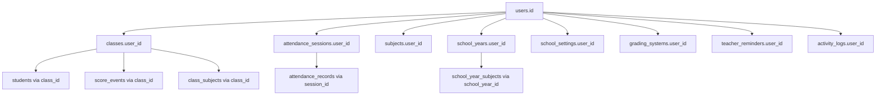

# GAP-001 — Per-teacher data isolation

**Priority:** P0 · **Status:** In progress · **Depends:** AUTH-001 shipped · **Unblocks:** GAP-002, GAP-032, GAP-042, hosted multi-teacher use

**Related:** [Gap-Backlog-Doc.md](../documentation/Gap-Backlog-Doc.md) · [Spec-Align-Doc.md](../documentation/Spec-Align-Doc.md) §2 · [Role-Based-Function.md](../documentation/Role-Based-Function.md) · [MH-Mobile-App-Deployment.md](../must-haves/MH-Mobile-App-Deployment.md) §A4 · [core.md](../schemas/core.md)

---

## Problem statement

TDTD was built as a **single-teacher local tool**: one SQLite file (`data/teacher_app.sqlite`), one implicit owner. JWT authentication (AUTH-001) gates `/api/*`, but **domain data has no ownership column**. Any authenticated teacher can list, read, or mutate any class, student, attendance session, score, or DepEd report if they know (or guess) a UUID.

| Layer | Today |
|-------|-------|
| Authentication | Shipped — JWT + refresh tokens |
| Global auth gate | Shipped — `authenticate` on protected routes |
| `user_id` on domain tables | **Missing** |
| Route-level ownership | **Missing** (GAP-002) |

**Risk:** Hosting with multiple teacher accounts is a P0 data-leak (IDOR) until GAP-001 + GAP-002 land.

---

## Goal

Ship **personal workspace per teacher** by adding `user_id` ownership to all teacher-mutable domain tables, migrating existing single-teacher data, and threading `userId` through the data layer.

**Tenancy decision:** Per-teacher for everything teachers mutate — classes, attendance, scores, subjects, school years, school settings, grading systems, reminders, and recents. No shared global catalog in v1.

---

## Boundary with GAP-002

| GAP-001 (this epic) | GAP-002 (follow-up) |
|---|---|
| Schema + migrations + backfill | Full route/controller audit |
| DAO/query signatures accept `userId` | Every handler passes `req.auth.id` |
| Services set `user_id` on create | 403 on cross-tenant ID access |
| Shared ownership helpers | Penetration-style IDOR test checklist |

---

## Tenancy model



### Anchor rule

`classes.user_id` is the root for roster/score/DepEd child rows.

**Join-scoped** (no denormalized `user_id` in v1):

- `students`, `class_subjects`, `score_events`, `score_entries`, `daily_attendance_records`, `computed_subject_grades`, `enrollment_history` — scoped via `classes.user_id` (or `score_events` → `classes`).

**Direct `user_id` required** (cannot derive from a single class):

- `classes`, `attendance_sessions`, `subjects`, `school_years`, `school_settings`, `grading_systems`, `teacher_reminders`, `activity_logs`

**Stay global (shared reference data):**

- `government_holidays` — national calendar; read-only for all teachers
- Auth tables (`users`, `refresh_tokens`, etc.) — unchanged

---

## Schema changes

| Table | Change | Constraint update |
|-------|--------|-------------------|
| `classes` | Add `user_id TEXT NOT NULL REFERENCES users(id)` | Index `idx_classes_user_id` |
| `attendance_sessions` | Add `user_id NOT NULL FK` | `UNIQUE(user_id, date, period)` replaces `UNIQUE(date, period)` |
| `subjects` | Add `user_id NOT NULL FK` | Per-user `(user_id, name)` and `(user_id, short_code)` unique indexes |
| `school_years` | Add `user_id NOT NULL FK` | Active year filtered per user |
| `school_settings` | Add `user_id NOT NULL FK` | One row per teacher; `UNIQUE(user_id)` |
| `grading_systems` | Add `user_id NOT NULL FK` | Per-teacher profiles |
| `teacher_reminders` | Add `user_id NOT NULL FK` | Open unique: `(user_id, type, date, period) WHERE status='open'` |
| `activity_logs` | Add `user_id NOT NULL FK` | Index `(user_id, created_at DESC)` |

**Attendance model change:** Sessions are **per-teacher** — each teacher gets their own AM/PM session for a date. Two teachers on the same host can both take AM attendance on 2026-07-10 without collision.

**Child tables:** Services validate ownership — student's class must belong to `userId`; score event's class must belong to `userId`; attendance record's student must belong to a class owned by the session's `user_id`.

DDL: [`tdtd-node/src/db/migrate.ts`](../../tdtd-node/src/db/migrate.ts) — `migrateUserOwnershipTables()`.

---

## Migration strategy

Follow existing rebuild pattern in `migrate.ts` (e.g. `migrateClassesTable`):

1. `migrateUserOwnershipTables(db)` runs after auth tables exist (needs `users` for FK backfill).
2. For each table: detect missing `user_id` column → create `__new` table → backfill → swap.
3. **Backfill rule:**
   - If exactly one user exists → assign all orphan rows to that user's `id`.
   - If zero users → assign to placeholder not used; first signup backfill handled separately (edge case for fresh DBs with seed data).
   - If multiple users on a shared pre-GAP-001 DB → require manual SQL script (document below).
4. Rebuild affected unique indexes (subjects, attendance_sessions, teacher_reminders).
5. `ON DELETE CASCADE` from `users` → owned rows: **not enabled in v1** (user deactivation uses `is_active`, not delete).

### Manual backfill (multi-user pre-migration)

If a deployment already has multiple teacher accounts sharing one DB before GAP-001:

```sql
-- Example: assign classes by adviser email match (adjust per deployment)
UPDATE classes SET user_id = (
  SELECT id FROM users WHERE email_normalized = LOWER(TRIM('teacher@example.com'))
) WHERE class_adviser_name = 'Jane Doe';
```

Run per deployment; no automatic heuristic beyond single-user backfill.

---

## Code changes

### Phase A — Schema + types

- `tdtd-node/src/db/migrate.ts` — `migrateUserOwnershipTables`
- `tdtd-node/src/schema/types.ts` — `userId` on owned row types
- `tdtd-node/src/queries/*.queries.ts` — `WHERE user_id = ?` or join `classes c ON ... AND c.user_id = ?`

### Phase B — DAO layer

All list/get/create/update functions accept `userId` where applicable. Priority:

1. `class.dao.ts`, `attendance.dao.ts`
2. `student.dao.ts`, `scoreEvent.dao.ts`, `scoreEntry.dao.ts`
3. `subject.dao.ts`, `schoolYear.dao.ts`, `schoolSettings.dao.ts`, `gradingSystem.dao.ts`
4. `activityLog.dao.ts`, `teacherReminder.dao.ts`, `studentLab.dao.ts`

### Phase C — Ownership helpers

`tdtd-node/src/lib/ownership.ts`:

- `assertClassOwned(db, classId, userId)` → `ClassRow` or 404
- `assertStudentOwned(db, studentId, userId)` → `StudentRow` or 404
- `assertSessionOwned(db, sessionId, userId)` → session or 404
- `assertScoreEventOwned(db, eventId, userId)` → event or 404

### Phase D — Service layer

Thread `userId: string` on all list/create/update functions. Set `user_id` on create.

### Phase E — Controllers

Use `AuthenticatedRequest`; pass `req.auth!.id` to services. Full route audit is GAP-002.

### Phase F — Batch module

**Approach:** Batch iterates all active users; runs reminder logic per `user_id`.

- `AttendanceReminderJob` — create per-user `teacher_reminders` rows with `user_id`
- `AttendanceReportDao`, `DepEdReportDao` — filter by `user_id` when generating per-teacher reports

### Phase G — Tests

- Migration: single-user backfill assigns existing rows
- Isolation: two users; user B cannot list user A's classes
- Attendance: two users same date/period get separate sessions

**Frontend:** No API contract changes — server filters by JWT.

---

## Acceptance criteria

- [ ] All tables in tenancy model have `user_id` (direct or join-validated)
- [ ] Migration backfills existing single-teacher deployments without data loss
- [ ] `listClasses(db, userId)` returns only that user's classes
- [ ] Two teachers on same host can both take AM attendance on the same date without collision
- [ ] Creating a class/subject/SY assigns authenticated user automatically
- [ ] Schema docs updated and match `migrate.ts`
- [ ] GAP-002 route audit linked as next step

---

## Risks and open items

- **Unique constraint changes** on `subjects` — post-migration scoped per user; pre-migration global dupes must be resolved first.
- **`school_settings` singleton** → per-user row; API returns authenticated user's settings only.
- **Sync stub** — pull/push must filter by `userId` when implemented (GAP-042); GAP-001 prepares schema only.
- **Government holidays** remain global — documented explicitly.

---

## Out of scope

- Full IDOR route audit → GAP-002
- Production HTTPS/deploy → GAP-003
- Mobile secure token storage → GAP-005
- Sync pull/push domain fan-out → GAP-042
- `authorize()` / admin RBAC wiring

---

## Changelog

| Date | Summary |
|------|---------|
| 2026-07-10 | Epic created; schema migration + data layer ownership threading started |
